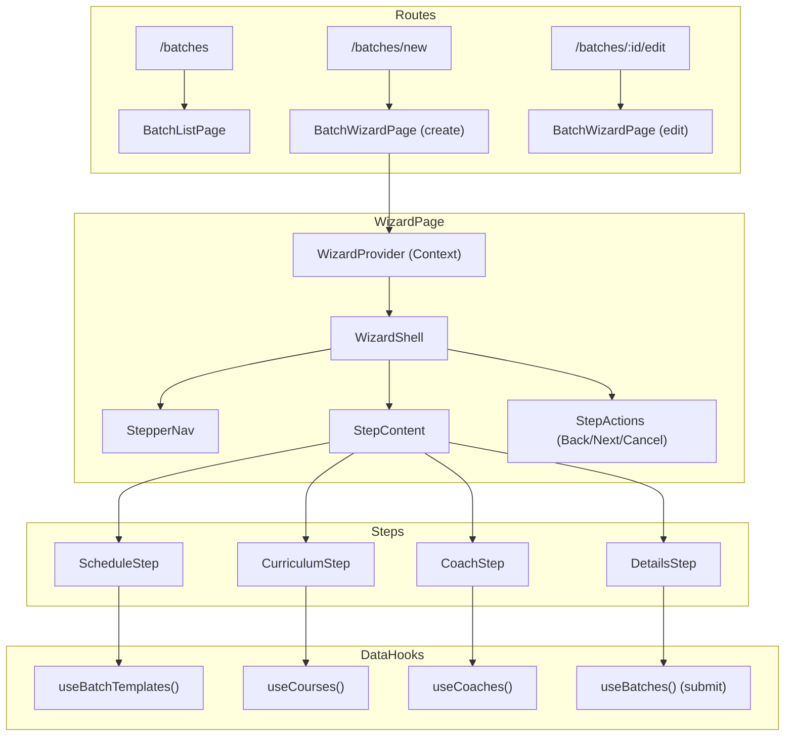
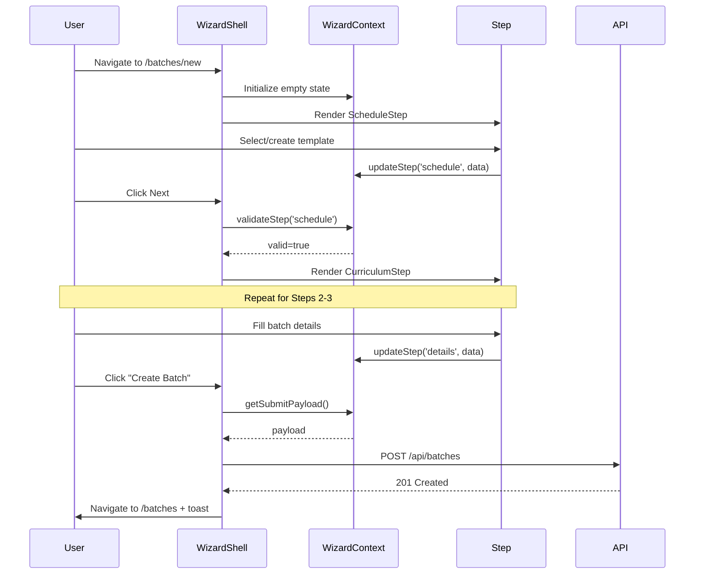

# Design Document: Batch Setup Wizard

## Overview

The Batch Setup Wizard replaces the existing modal-based batch creation/editing flow with a full-page, multi-step wizard. It consolidates template creation, curriculum attachment, coach assignment, and batch details into a single guided experience under the `/batches/new` and `/batches/:id/edit` routes.

The wizard is a **frontend-only feature** — no new API endpoints are required. It reuses existing `POST /api/batches`, `PATCH /api/batches/:id`, `GET /api/batches`, `GET /api/coaches`, and `GET /api/courses` endpoints. The navigation is simplified from the current Training dropdown to a flat 4-item primary nav: Dashboard, Batches, Students, Finance.

### Key Design Decisions

| Decision | Choice | Rationale |
|----------|--------|-----------|
| State management | React Context (`WizardContext`) | Steps share state; local `useState` would require prop drilling across 4+ components |
| Component structure | WizardShell + StepComponents | Shell handles stepper UI/routing; steps are self-contained |
| Inline creation | Collapsible form sections within steps | Avoids modal-in-wizard complexity; stays in-flow |
| Route structure | `/batches`, `/batches/new`, `/batches/:id/edit` | RESTful; edit reuses wizard with pre-populated context |
| Navigation change | 4 flat items (no Training dropdown) | Simplifies discovery; Batches is the main entry point |

---

## Architecture



### Data Flow



---

## Components and Interfaces

### Component Hierarchy

```
BatchWizardPage
├── WizardProvider
│   └── WizardShell
│       ├── StepperNav (tab headings)
│       ├── StepContent (renders active step)
│       │   ├── ScheduleStep
│       │   │   ├── TemplateList (select existing)
│       │   │   └── InlineTemplateForm (create new)
│       │   ├── CurriculumStep
│       │   │   ├── CourseCardGrid (select existing)
│       │   │   └── InlineCourseForm (create new — name only)
│       │   ├── CoachStep
│       │   │   └── CoachCardGrid
│       │   └── DetailsStep
│       │       ├── SummaryCard (read-only recap)
│       │       └── BatchDetailsForm
│       └── StepActions (Back / Next / Cancel / Submit)
```

### WizardContext Interface

```typescript
interface WizardState {
  mode: 'create' | 'edit';
  batchId?: string; // set in edit mode
  currentStep: number; // 0-3
  completedSteps: Set<number>;

  // Step 1: Schedule
  schedule: {
    templateId: string | null;
    templateName: string | null;
    daysOfWeek: number[]; // 0=Sun, 1=Mon, ..., 6=Sat
    startTime: string; // "HH:mm"
    duration: number; // hours: 1, 1.5, 2, 2.5, 3, 3.5, 4
    isNewTemplate: boolean;
  };

  // Step 2: Curriculum
  curriculum: {
    courseId: string | null;
    courseName: string | null;
    weekCount: number | null;
  };

  // Step 3: Coach
  coach: {
    coachId: string | null;
    coachName: string | null;
    coachRole: string | null;
  };

  // Step 4: Details
  details: {
    name: string;
    skillLevel: SkillLevel | '';
    capacity: number | '';
  };
}

interface WizardContextValue {
  state: WizardState;
  updateSchedule: (data: Partial<WizardState['schedule']>) => void;
  updateCurriculum: (data: Partial<WizardState['curriculum']>) => void;
  updateCoach: (data: Partial<WizardState['coach']>) => void;
  updateDetails: (data: Partial<WizardState['details']>) => void;
  goToStep: (step: number) => void;
  goNext: () => void;
  goBack: () => void;
  canGoNext: () => boolean;
  canGoToStep: (step: number) => boolean;
  isStepValid: (step: number) => boolean;
  reset: () => void;
  getSubmitPayload: () => BatchSubmitPayload;
}
```

### Step Validation Rules

| Step | Required Fields | Optional |
|------|----------------|----------|
| 0 — Schedule | `templateId` OR (`daysOfWeek.length > 0` AND `startTime` AND `duration` AND `templateName` if new) | — |
| 1 — Curriculum | None | `courseId` |
| 2 — Coach | None | `coachId` |
| 3 — Details | `name` (non-empty, trimmed) | `skillLevel`, `capacity` |

### BatchSubmitPayload

```typescript
interface BatchSubmitPayload {
  name: string;
  template_id?: string;
  curriculum_id?: string;
  assigned_coach_id?: string;
  skill_level?: string;
  capacity?: number;
  // For new template creation (handled before batch submit)
  newTemplate?: {
    name: string;
    days_of_week: number[];
    start_time: string;
    duration: number;
  };
}
```

### StepperNav Props

```typescript
interface StepperNavProps {
  steps: StepDefinition[];
  currentStep: number;
  completedSteps: Set<number>;
  onStepClick: (step: number) => void;
}

interface StepDefinition {
  index: number;
  label: string;
  icon?: React.ReactNode;
}

const WIZARD_STEPS: StepDefinition[] = [
  { index: 0, label: 'Batch Timing Template' },
  { index: 1, label: 'Curriculum Preparation' },
  { index: 2, label: 'Assign Coach' },
  { index: 3, label: 'Batch Details' },
];
```

### Navigation Config (Simplified)

```typescript
const SIMPLIFIED_NAV: NavEntry[] = [
  { label: 'Dashboard', path: '/dashboard' },
  { label: 'Batches', path: '/batches' },
  { label: 'Students', path: '/students' },
  {
    label: 'Finance',
    items: [
      { label: 'Fees', path: '/fees' },
      { label: 'Accounts', path: '/ledger' },
    ],
  },
];
```

---

## Data Models

### Existing Types (reused as-is)

- `Batch` — from `src/types/index.ts`
- `User` (coach) — from `src/types/index.ts`
- `Course` — from `src/hooks/useCourses.ts`
- `SkillLevel` — `'Beginner' | 'Intermediate' | 'Advanced' | 'Professional'`

### New Types

```typescript
/** Template summary for display in Step 1 */
interface BatchTimeTemplate {
  id: string;
  name: string;
  days_of_week: number[]; // 0-6
  start_time: string; // "HH:mm"
  duration: number; // hours
}

/** Coach card display data for Step 3 */
interface CoachCardData {
  id: string;
  name: string;
  role: 'HEAD_COACH' | 'ASSISTANT_COACH';
  batchCount?: number; // workload indicator
}

/** Duration options for template creation */
const DURATION_OPTIONS = [1, 1.5, 2, 2.5, 3, 3.5, 4] as const;
type Duration = typeof DURATION_OPTIONS[number];

/** Day labels for toggle display */
const DAY_LABELS = ['Sun', 'Mon', 'Tue', 'Wed', 'Thu', 'Fri', 'Sat'] as const;
```

### API Payload Mapping

The wizard maps its internal state to the existing `POST /api/batches` payload:

```typescript
// WizardState → API Payload
function buildBatchPayload(state: WizardState): Record<string, unknown> {
  return {
    name: state.details.name.trim(),
    template_id: state.schedule.templateId,
    curriculum_id: state.curriculum.courseId,
    assigned_coach_id: state.coach.coachId,
    skill_level: state.details.skillLevel || undefined,
    capacity: state.details.capacity || undefined,
    // If new template was created inline, template_id comes from
    // a prior POST /api/batch-time-templates call
  };
}
```

### Edit Mode Data Loading

```typescript
// Batch record → WizardState (for edit pre-population)
function batchToWizardState(batch: BatchRecord): WizardState {
  return {
    mode: 'edit',
    batchId: batch.id,
    currentStep: 0,
    completedSteps: new Set([0, 1, 2, 3]),
    schedule: {
      templateId: batch.template_id ?? null,
      templateName: batch.template_name ?? null,
      daysOfWeek: batch.days_of_week?.map(d => dayNameToIndex(d)) ?? [],
      startTime: batch.start_time ?? '',
      duration: computeDuration(batch.start_time, batch.end_time),
      isNewTemplate: false,
    },
    curriculum: {
      courseId: batch.curriculum_id ?? null,
      courseName: batch.curriculum_name ?? null,
      weekCount: null, // fetched separately if needed
    },
    coach: {
      coachId: batch.assigned_coach_id ?? null,
      coachName: batch.coach_name ?? null,
      coachRole: batch.coach_role ?? null,
    },
    details: {
      name: batch.name,
      skillLevel: (batch.skill_level as SkillLevel) ?? '',
      capacity: batch.capacity ?? '',
    },
  };
}
```

---

## Correctness Properties

*A property is a characteristic or behavior that should hold true across all valid executions of a system — essentially, a formal statement about what the system should do. Properties serve as the bridge between human-readable specifications and machine-verifiable correctness guarantees.*

### Property 1: Back navigation preserves wizard state

*For any* wizard state with data entered across one or more steps, navigating backward (goBack) and then forward (goNext) SHALL produce a wizard state identical to the original state for all step data fields.

**Validates: Requirements 1.4**

### Property 2: Forward navigation gating by step validity

*For any* combination of step completion states, the wizard SHALL allow navigation to step N only when all steps 0 through N-1 satisfy their respective validation rules. Conversely, if any step K < N is invalid, navigation to step N SHALL be blocked.

**Validates: Requirements 1.6, 2.5**

### Property 3: Template creation validation

*For any* template form input, the form SHALL accept the input if and only if: the template name is non-empty (after trimming), at least one day of the week is selected, a start time is provided, and the duration is one of [1, 1.5, 2, 2.5, 3, 3.5, 4]. All other inputs SHALL be rejected.

**Validates: Requirements 2.3**

### Property 4: Step 4 summary displays all prior selections

*For any* wizard state where steps 1–3 have selections (template with days/time, curriculum with name/weeks, coach with name/role), the Step 4 summary card SHALL contain text representations of all selected values. When a step has no selection (curriculum or coach skipped), the summary SHALL indicate "None selected" or equivalent.

**Validates: Requirements 2.4, 3.3, 4.2, 5.5**

### Property 5: Step 4 field validation

*For any* batch name input that is empty or contains only whitespace characters, submission SHALL be rejected. *For any* capacity input that is not a positive integer (≤ 0, non-numeric, or fractional), the form SHALL reject it. *For any* non-empty trimmed name with a valid or empty capacity, the form SHALL accept submission.

**Validates: Requirements 5.2, 5.4**

### Property 6: Edit mode pre-population correctness

*For any* existing batch record loaded into edit mode, the wizard state SHALL contain: the batch's template_id mapped to schedule.templateId, the batch's curriculum_id mapped to curriculum.courseId, the batch's assigned_coach_id mapped to coach.coachId, and the batch's name/skill_level/capacity mapped to details. All four steps SHALL be marked as completed.

**Validates: Requirements 6.1**

### Property 7: Coach card displays name and role

*For any* coach object with a name and role field, the rendered coach selection card SHALL contain text matching the coach's name and a label indicating their role (HEAD_COACH or ASSISTANT_COACH).

**Validates: Requirements 4.2**

---

## Error Handling

| Scenario | Handling |
|----------|----------|
| API error on batch submit (POST/PATCH) | Display error message in a toast or inline alert on Step 4. Remain on Step 4. Do not clear form. |
| API error on template creation | Display inline error below template form. Do not advance step. |
| Network failure during data fetch (templates, courses, coaches) | Show "Failed to load" message with retry button within the step. |
| Edit mode — batch not found (404) | Redirect to `/batches` with error toast: "Batch not found." |
| Unsaved changes + browser back/close | Register `beforeunload` event listener when wizard state is dirty. |
| Cancel confirmation | Show browser `confirm()` dialog: "Discard unsaved changes?" |
| Validation error on step advance | Highlight invalid fields with error messages. Prevent Next. |
| Role violation (ASSISTANT_COACH navigates to /batches/new) | `ProtectedRoute` with `allowedRoles={['HEAD_COACH']}` blocks access; redirect to /batches. |

---

## Testing Strategy

### Unit Tests (Example-Based)

Cover specific scenarios and rendering:
- StepperNav renders 4 labels, highlights current step
- Cancel triggers confirmation dialog
- Skill level dropdown contains exactly 4 options
- ASSISTANT_COACH sees read-only batch list (no Add/Edit buttons)
- HEAD_COACH sees Add Batch button
- Edit mode shows "Edit Batch" title and "Save Changes" button
- Optional steps (curriculum, coach) allow Next without selection
- API error displays inline message on Step 4
- Successful submit navigates to /batches

### Property-Based Tests

Use `fast-check` for property-based testing (already available in the project's test ecosystem via vitest):

- **Property 1**: Generate random wizard states, apply goBack+goNext, assert state equality
- **Property 2**: Generate random step validity arrays, assert canGoToStep matches spec
- **Property 3**: Generate random template inputs (strings, day arrays, times, durations), assert validation result matches rules
- **Property 4**: Generate random wizard states with selections, assert summary card text contains all values
- **Property 5**: Generate random strings (whitespace, empty, valid) and numbers (negative, zero, float, positive int), assert validation
- **Property 6**: Generate random batch records, apply batchToWizardState, assert field mapping
- **Property 7**: Generate random coach objects, assert rendered output contains name and role

**Configuration:**
- Minimum 100 iterations per property test
- Tag format: `Feature: batch-setup-wizard, Property {N}: {title}`

### Integration Tests

- Full wizard flow: fill all steps → submit → verify API call payload
- Edit flow: load existing batch → modify name → save → verify PATCH call
- Navigation: verify `/batches/new` and `/batches/:id/edit` render wizard correctly
