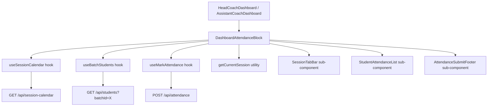

# Design Document: Coach Dashboard Attendance

## Overview

This feature replaces the existing `QuickAttendanceWidget` with a more comprehensive **Dashboard Attendance Block** that provides today's session calendar view, automatic current-session detection, student list display, and single-tap attendance marking. The widget is placed prominently on both `HeadCoachDashboard` and `AssistantCoachDashboard` pages.

The design leverages the existing `useSessionCalendar` hook for fetching session data, the `useMarkAttendance` hook for submission, and the existing `/api/students?batchId=X` endpoint for fetching batch students. No new backend APIs are needed — this is a frontend-only feature.

### Key Design Decisions

1. **Enhance vs. Replace**: Create a new `DashboardAttendanceBlock` component rather than modifying `QuickAttendanceWidget`. The existing widget has a simpler scope (single next session). The new block has multi-session navigation, calendar view, and richer state management. The old widget can be deprecated once the new block is deployed.

2. **Current Session Detection**: Pure frontend logic in a utility function `getCurrentSession(entries, now)`. No backend involvement — the function examines today's `CalendarEntry[]` against the current time.

3. **Student Fetching**: Uses existing `GET /api/students?batchId=X` via `apiClient`. Wrapped in a lightweight `useBatchStudents(batchId)` hook for reactivity.

4. **State Management**: Local component state with optimistic UI. An `attendanceMap: Record<studentId, AttendanceStatus>` tracks marks before submission. No global state library needed.

5. **Layout Position**: The attendance block replaces the current `QuickAttendanceWidget` position and is placed above the overview grid in both dashboards.

6. **Multi-Session Days**: A horizontal session tab bar at the top of the block allows selecting between today's sessions. The current/next session is auto-selected.

## Architecture



### Component Hierarchy

```
DashboardAttendanceBlock (main container)
├── SessionTabBar (horizontal session selector)
│   └── SessionTab (individual session chip)
├── StudentAttendanceList (scrollable student list)
│   └── StudentAttendanceRow (name + P/A toggles)
└── AttendanceSubmitFooter (submit button + status)
```

## Components and Interfaces

### DashboardAttendanceBlock

The top-level widget component. Manages state coordination between session selection, student fetching, and attendance marking.

```typescript
interface DashboardAttendanceBlockProps {
  calendarEntries: CalendarEntry[];
  calendarLoading: boolean;
}
```

**Internal State:**
- `selectedSessionIndex: number` — which session tab is active
- `attendanceMap: Record<string, AttendanceStatus>` — per-student marks
- `widgetState: 'idle' | 'submitting' | 'success' | 'all-complete'`

### SessionTabBar

Displays today's sessions as selectable tabs/chips. Highlights the auto-detected current session. Shows visual indicators for already-recorded sessions.

```typescript
interface SessionTabBarProps {
  sessions: CalendarEntry[];
  selectedIndex: number;
  onSelect: (index: number) => void;
}
```

### StudentAttendanceRow

Single row: student name + present/absent toggle buttons.

```typescript
interface StudentAttendanceRowProps {
  student: Student;
  status: AttendanceStatus | undefined;
  onToggle: (studentId: string, status: AttendanceStatus) => void;
}
```

### useBatchStudents Hook

A lightweight hook wrapping the student fetch by batchId. Reacts to batchId changes.

```typescript
function useBatchStudents(batchId: string | undefined): {
  students: Student[];
  loading: boolean;
  error: string | null;
}
```

### getCurrentSession Utility

Pure function that implements the current session detection logic.

```typescript
function getCurrentSession(
  todaySessions: CalendarEntry[],
  now: Date
): { session: CalendarEntry | null; index: number }
```

**Algorithm:**
1. Filter entries to today only, sorted by startTime
2. Find a session where `startTime <= currentTime <= endTime` → return it (in-progress)
3. If none in-progress, find the first session where `startTime > currentTime` → return it (next upcoming)
4. If all ended, find the last session where `attendanceRecorded === false` → return it
5. If all recorded, return `null` (triggers "all complete" state)

### getTodaySessions Utility

Filters and sorts calendar entries to only today's sessions.

```typescript
function getTodaySessions(entries: CalendarEntry[]): CalendarEntry[]
```

## Data Models

### Existing Types Used

- `CalendarEntry` — from `src/types/index.ts`, includes `date`, `startTime`, `endTime`, `batchId`, `batchName`, `attendanceRecorded`
- `Student` — from `src/types/index.ts`, includes `id`, `fullName`
- `AttendanceStatus` — `'PRESENT' | 'ABSENT' | 'LATE'`
- `MarkAttendanceData` — from `useAttendance.ts`, payload for POST

### New Internal Types

```typescript
// Widget state machine
type AttendanceBlockState = 'loading' | 'no-sessions' | 'idle' | 'submitting' | 'success' | 'all-complete';

// Per-student attendance tracking (local state before submission)
type AttendanceMap = Record<string, AttendanceStatus>;
```

### Data Flow

1. Dashboard mounts → `useSessionCalendar` fetches entries for today through 14 days ahead (existing behavior)
2. `DashboardAttendanceBlock` receives `calendarEntries` → `getTodaySessions()` filters to today
3. `getCurrentSession()` auto-selects the relevant session
4. `useBatchStudents(selectedSession.batchId)` fetches students
5. Coach toggles attendance → local `attendanceMap` updates immediately (optimistic)
6. Coach clicks Submit → `useMarkAttendance` sends payload to API
7. On success → widget shows confirmation, marks session as recorded

## Correctness Properties

*A property is a characteristic or behavior that should hold true across all valid executions of a system — essentially, a formal statement about what the system should do. Properties serve as the bridge between human-readable specifications and machine-verifiable correctness guarantees.*

### Property 1: Today's session rendering completeness

*For any* set of `CalendarEntry[]` where some entries have `date === today`, the `getTodaySessions` filter function SHALL return exactly those entries whose date matches today, and each returned entry SHALL contain a non-empty `batchName`, `startTime`, and `endTime`.

**Validates: Requirements 1.1, 1.2**

### Property 2: Current session detection correctness

*For any* non-empty set of today's sessions and any given current time, the `getCurrentSession` function SHALL return:
- The in-progress session (where `startTime <= now <= endTime`) if one exists, OR
- The next upcoming session (earliest `startTime > now`) if no session is in-progress, OR
- The last session with `attendanceRecorded === false` if all sessions have ended, OR
- `null` if all sessions have `attendanceRecorded === true`

**Validates: Requirements 2.1, 2.2, 2.3, 2.4**

### Property 3: Session chronological ordering

*For any* set of `CalendarEntry[]` returned by `getTodaySessions`, the output SHALL be sorted such that for every adjacent pair `(sessions[i], sessions[i+1])`, `sessions[i].startTime <= sessions[i+1].startTime`.

**Validates: Requirements 1.5**

### Property 4: Student list completeness with toggles

*For any* non-empty list of students fetched for a batch, the attendance UI state SHALL contain an entry point (toggle) for each student's `id`, and the rendered output SHALL include each student's `fullName`.

**Validates: Requirements 3.2, 4.1**

### Property 5: Attendance submission payload integrity

*For any* `attendanceMap` where all students have a status assigned, the submission payload sent to the API SHALL contain exactly one record per student with the correct `studentId`, `status`, `batchId`, and `sessionDate`.

**Validates: Requirements 4.6**

## Error Handling

| Scenario | Handling |
|----------|----------|
| Calendar API fails | Show error state in widget with retry button. Existing `useSessionCalendar` hook returns empty entries. |
| Student fetch fails | Show "Failed to load students" message within the widget. Retry on session re-selection. |
| Attendance submission fails | Show error toast, preserve `attendanceMap` state so coach can retry without re-marking. |
| No sessions today | Show "No sessions scheduled today" empty state. |
| All attendance recorded | Show "All attendance submitted ✓" completion state. |
| Network timeout | Leveraged by `apiClient` interceptor. Generic error message displayed. |

## Testing Strategy

### Unit Tests (Example-Based)

- Loading skeleton renders when `calendarLoading === true`
- Empty state renders when no today sessions exist
- Completion state renders when all sessions have `attendanceRecorded === true`
- Clicking present toggle updates local state to `PRESENT`
- Clicking absent toggle updates local state to `ABSENT`
- Submit button disabled until all students marked
- Error message displayed on submission failure
- Success confirmation displayed after successful submit
- Session tab selection loads students for new batch
- Visual indicator differentiates recorded vs. pending sessions

### Property-Based Tests

Property-based testing is appropriate for this feature because the core logic functions (`getCurrentSession`, `getTodaySessions`, submission payload construction) are pure functions with clear input/output behavior and a large input space (varying times, session counts, student counts).

**Library**: `fast-check` (already standard for TypeScript/React projects)

**Configuration**: Minimum 100 iterations per property test.

Each property test will be tagged:
- `Feature: coach-dashboard-attendance, Property 1: Today's session rendering completeness`
- `Feature: coach-dashboard-attendance, Property 2: Current session detection correctness`
- `Feature: coach-dashboard-attendance, Property 3: Session chronological ordering`
- `Feature: coach-dashboard-attendance, Property 4: Student list completeness with toggles`
- `Feature: coach-dashboard-attendance, Property 5: Attendance submission payload integrity`

### Integration Tests

- Role-based filtering: HEAD_COACH sees all batches, ASSISTANT_COACH sees only assigned batches (API-level)
- Component renders on both `HeadCoachDashboard` and `AssistantCoachDashboard`
- `useSessionCalendar` hook is called with correct date range
- `POST /api/attendance` is called with correct endpoint and payload structure
