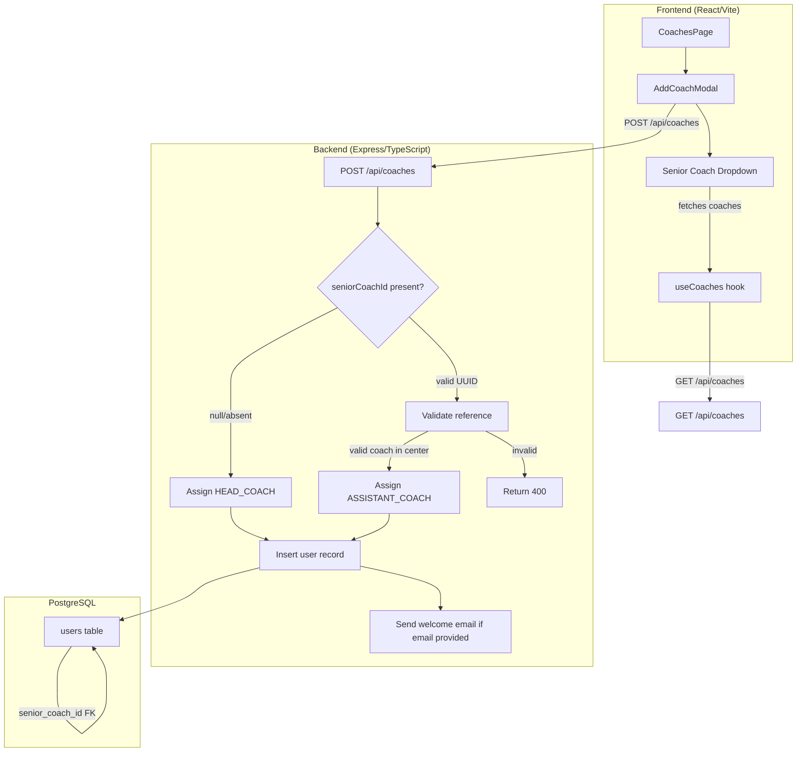

# Design Document: Coach Hierarchy

## Overview

This feature replaces the existing "Add Assistant Coach" workflow with a unified "Add Coach" form that supports both head coach and assistant coach creation through a single interface. The coach's role is determined implicitly by the presence or absence of a senior coach selection—selecting a senior coach creates an assistant coach, while leaving the field empty creates a head coach.

The change spans the full stack: a database migration adds `senior_coach_id` to the `users` table, the `POST /api/coaches` endpoint gains conditional role assignment logic and validation, and the frontend `AddCoachModal` component gets a new optional "Senior Coach" dropdown populated from the existing coaches list.

## Architecture



## Components and Interfaces

### Backend

#### Modified: `POST /api/coaches` Controller (`src/controllers/coaches.ts`)

**Request body changes:**

```typescript
interface CreateCoachRequest {
  name: string;           // required
  username: string;       // required
  password: string;       // required
  email?: string;         // optional
  specialization?: string; // optional
  profilePhoto?: string;  // optional
  seniorCoachId?: string | null; // NEW - optional UUID
}
```

**Response payload changes (201):**

```typescript
interface CreateCoachResponse {
  id: string;
  username: string;
  role: 'HEAD_COACH' | 'ASSISTANT_COACH';
  name: string;
  email: string | null;
  profilePhoto: string | null;
  specialization: string | null;
  seniorCoachId: string | null; // NEW
  createdAt: string;
  lastActive: string;
}
```

**New validation logic:**
1. If `seniorCoachId` is provided and non-null:
   - Validate UUID format (regex check)
   - Query the `users` table for a user with that ID, with role `HEAD_COACH` or `ASSISTANT_COACH`, in the same `center_id` as the requesting user
   - Reject with 400 if validation fails
   - Assign role `ASSISTANT_COACH`
2. If `seniorCoachId` is absent or null:
   - Assign role `HEAD_COACH`
   - Store `senior_coach_id` as NULL

#### Modified: `GET /api/coaches` Controller

No changes needed. The existing endpoint already returns all coaches (HEAD_COACH and ASSISTANT_COACH) at the current center, sorted by name. The frontend will consume this for the dropdown.

#### Utility: UUID Validation

```typescript
function isValidUUID(value: string): boolean {
  return /^[0-9a-f]{8}-[0-9a-f]{4}-[0-9a-f]{4}-[0-9a-f]{4}-[0-9a-f]{12}$/i.test(value);
}
```

### Frontend

#### Modified: `AddCoachModal` Component

**Props changes:**

```typescript
interface AddCoachModalProps {
  isOpen: boolean;
  onClose: () => void;
  onSubmit: (coachData: CoachFormData) => Promise<void>;
  coaches: User[]; // NEW - list of existing coaches for dropdown
}
```

**Form data changes:**

```typescript
export interface CoachFormData {
  name: string;
  username: string;
  password: string;
  email?: string;
  specialization?: string;
  profilePhoto?: string;
  seniorCoachId?: string; // NEW - optional
}
```

**UI changes:**
- Title: "Add Coach" (was "Add Assistant Coach")
- Subtitle: "Create a new coach account" (was "Create a new assistant coach account")
- New `<select>` field after Profile Photo URL:
  - Label: "Senior Coach" with "(optional)" indicator
  - Options: empty option + all coaches sorted alphabetically by name
  - Disabled during form submission

#### Modified: `CoachesPage` Component

- Button text: "+ Add Coach" (was "+ Add Assistant Coach")
- Pass `coaches` prop to `AddCoachModal`
- Update `handleAddCoach` to include `seniorCoachId` in API call

#### Modified: `useCoaches` Hook

```typescript
export interface CreateCoachData {
  username: string;
  password: string;
  name: string;
  email?: string;
  profilePhoto?: string;
  specialization?: string;
  seniorCoachId?: string; // NEW
}
```

## Data Models

### Database Migration: `020_add_senior_coach_id.sql`

```sql
-- Add senior_coach_id column to users table
ALTER TABLE users
  ADD COLUMN senior_coach_id UUID REFERENCES users(id) ON DELETE SET NULL;

-- Index for query performance
CREATE INDEX idx_users_senior_coach_id ON users(senior_coach_id);

-- Prevent self-referencing (a coach cannot be their own senior)
ALTER TABLE users
  ADD CONSTRAINT chk_no_self_reference
  CHECK (senior_coach_id IS NULL OR senior_coach_id != id);
```

### Modified Table: `users`

| Column | Type | Constraints | Description |
|--------|------|-------------|-------------|
| senior_coach_id | UUID | NULLABLE, FK → users(id) ON DELETE SET NULL, CHECK (senior_coach_id != id) | References the senior/supervising coach |

### Role Determination Logic

| seniorCoachId in request | Assigned role | senior_coach_id stored |
|--------------------------|---------------|------------------------|
| absent / null            | HEAD_COACH    | NULL                   |
| valid coach UUID         | ASSISTANT_COACH | the provided UUID    |

## Correctness Properties

*A property is a characteristic or behavior that should hold true across all valid executions of a system—essentially, a formal statement about what the system should do. Properties serve as the bridge between human-readable specifications and machine-verifiable correctness guarantees.*

### Property 1: Coach dropdown filtering and sorting

*For any* list of users at a center with mixed roles (HEAD_COACH, ASSISTANT_COACH, STUDENT, ADMIN), the Senior Coach dropdown SHALL only include users with role HEAD_COACH or ASSISTANT_COACH from the current center, and the resulting list SHALL be sorted alphabetically by full name (case-insensitive).

**Validates: Requirements 2.1**

### Property 2: Role determination based on seniorCoachId presence

*For any* valid coach creation payload, if `seniorCoachId` is absent or null, the resulting coach record SHALL have role HEAD_COACH and `senior_coach_id` NULL; if `seniorCoachId` is a valid reference to an existing coach in the same center, the resulting coach record SHALL have role ASSISTANT_COACH and `senior_coach_id` equal to the provided value.

**Validates: Requirements 3.1, 3.2, 3.3**

### Property 3: Senior coach reference validation

*For any* `seniorCoachId` value provided in a coach creation request, if the value is not a valid UUID format, OR does not reference an existing user, OR the referenced user does not have role HEAD_COACH or ASSISTANT_COACH, OR the referenced user belongs to a different center than the requester, THEN the API SHALL reject the request with a 400 status code.

**Validates: Requirements 4.2, 4.3, 4.4**

### Property 4: Self-reference prevention

*For any* user record in the system, the `senior_coach_id` column SHALL never equal the user's own `id`. Any attempt to create or update a record where `senior_coach_id = id` SHALL be rejected.

**Validates: Requirements 5.4**

## Error Handling

### API Error Responses

| Condition | HTTP Status | Error Message |
|-----------|-------------|---------------|
| Missing required fields (name, username, password) | 400 | "Name, username, and password are required" |
| Username already exists | 400 | "Username already exists" |
| seniorCoachId is not a valid UUID | 400 | "Senior coach ID format is invalid" |
| seniorCoachId references non-existent user, non-coach role, or different center | 400 | "Invalid senior coach reference. The selected coach does not exist or is not available at this center." |
| Server error | 500 | "An error occurred while creating the coach account" |

### Frontend Error Handling

- API errors are displayed in a form-level error banner inside the modal
- Network failures show a generic "Failed to add coach. Please try again." message
- The form remains open on error so the user can correct and retry
- The submit button shows "Adding..." during submission and all fields (including dropdown) are disabled

### Welcome Email Failures

- Email sending remains fire-and-forget (non-blocking)
- Email failures are logged server-side but do not affect the API response
- Behavior is identical for both HEAD_COACH and ASSISTANT_COACH roles

## Testing Strategy

### Unit Tests (Example-Based)

**Backend:**
- Verify 400 when seniorCoachId is a malformed UUID (e.g., "not-a-uuid")
- Verify 400 when seniorCoachId references a STUDENT role user
- Verify 400 when seniorCoachId references a user in a different center
- Verify 201 with HEAD_COACH role when seniorCoachId is omitted
- Verify 201 with ASSISTANT_COACH role when valid seniorCoachId is provided
- Verify response payload contains `seniorCoachId` field
- Verify welcome email is called for both roles when email is present
- Verify welcome email is NOT called when email is absent

**Frontend:**
- Modal title renders "Add Coach"
- Button label renders "+ Add Coach"
- Senior Coach dropdown appears after Profile Photo URL field
- Dropdown shows "(optional)" indicator, no required asterisk
- Dropdown lists coaches sorted alphabetically
- Dropdown is disabled during submission
- Empty coaches list renders empty dropdown
- Form submits seniorCoachId when a coach is selected
- Form submits without seniorCoachId when no coach is selected

### Property-Based Tests

Property-based testing is appropriate for this feature because the role determination logic and validation logic are pure functions with clear input/output behavior and a large input space.

**Library:** fast-check (TypeScript)  
**Minimum iterations:** 100 per property

- **Property 1** (Coach dropdown filtering): Generate random user lists with various roles/centers, verify filtering and sorting. Tag: `Feature: coach-hierarchy, Property 1: Coach dropdown filtering and sorting`
- **Property 2** (Role determination): Generate random valid payloads with and without seniorCoachId, verify role assignment. Tag: `Feature: coach-hierarchy, Property 2: Role determination based on seniorCoachId presence`
- **Property 3** (Validation): Generate random invalid seniorCoachId values (bad UUIDs, wrong center, wrong role, non-existent), verify rejection. Tag: `Feature: coach-hierarchy, Property 3: Senior coach reference validation`
- **Property 4** (Self-reference): Generate random user records, attempt self-reference, verify rejection. Tag: `Feature: coach-hierarchy, Property 4: Self-reference prevention`

### Integration Tests

- Migration runs successfully and `senior_coach_id` column exists with correct constraints
- ON DELETE SET NULL behavior works (delete senior coach, verify references become NULL)
- Index exists on `senior_coach_id`
- End-to-end coach creation flow with and without senior coach selection
