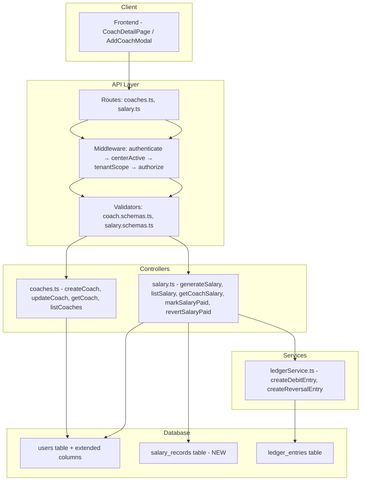
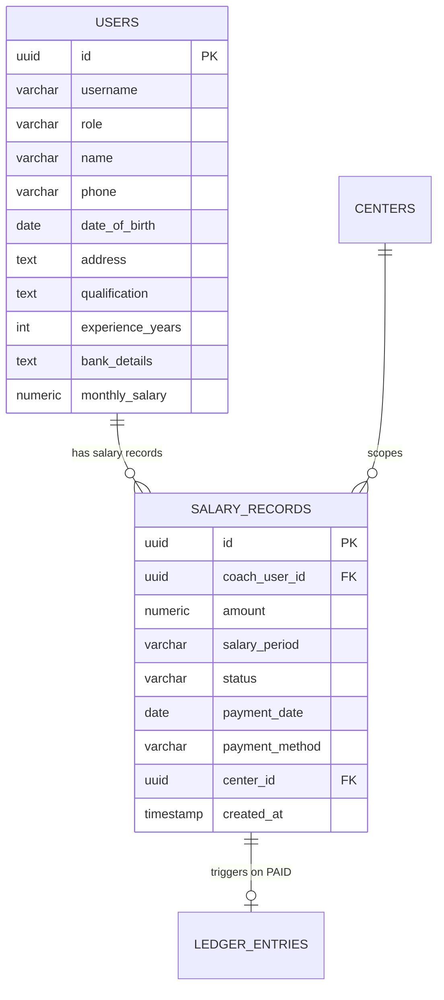

# Design Document: Coach Salary Profile

## Overview

This feature extends the coach profile with detailed personal/professional fields (phone, date of birth, address, qualification, experience, bank details, monthly salary) and introduces a salary record lifecycle: auto-generation of PENDING records per month, manual pay/revert operations with ledger integration.

The implementation builds on the existing Express/TypeScript API patterns — controllers, Zod validators, tenant-scoped middleware — and integrates with the already-coded `ledgerService.ts` for DEBIT/CREDIT entries on salary pay/revert.

### Key Design Decisions

1. **Extended fields on the `users` table** rather than a separate `coach_profiles` table — keeps queries simple and avoids JOINs for profile retrieval. All new columns are nullable for backward-compatibility.
2. **`salary_records` as a new table** — mirrors the `fee_records` pattern with status-driven lifecycle (PENDING → PAID, reversible).
3. **API-triggered salary generation** — `POST /api/salary/generate` with a `period` param (YYYY-MM). No cron dependency initially; a scheduled trigger can be added later without code changes.
4. **Reuse existing salary controller** — `markSalaryPaid` and `revertSalaryPaid` already handle pay/revert with ledger integration; we add generation, listing, and coach-specific history endpoints alongside them.
5. **Access control via existing middleware** — `authorize(UserRole.HEAD_COACH)` on write operations; assistant coaches can read their own profile via a conditional check in the GET endpoint.

---

## Architecture



### Request Flow

1. Client sends request → Express router matches route
2. `authenticate` middleware validates JWT, resolves center from `X-Center-Id` header
3. `centerActive` checks center is active
4. `tenantScope` attaches `tenantCenterId` to request
5. `authorize(HEAD_COACH)` enforces role (except GET own-profile for assistants)
6. Zod validator checks request body/params
7. Controller executes business logic with tenant-scoped queries
8. For salary pay/revert: controller calls `ledgerService` to create ledger entries

---

## Components and Interfaces

### 1. Database Migration (022_coach_salary_profile.sql)

Adds new columns to `users` and creates the `salary_records` table.

### 2. Extended Coach Validator (coach.schemas.ts)

Updates `createCoachSchema` and adds `updateCoachSchema` to accept extended fields with proper Zod validation.

### 3. Salary Validator (salary.schemas.ts — NEW)

Zod schemas for salary generation (`generateSalarySchema`) and listing queries.

### 4. Coach Controller (coaches.ts — extended)

- `createCoach` — accepts and persists extended fields
- `updateCoach` — accepts extended fields including `monthly_salary`
- `getCoach` — NEW: returns full profile for a single coach by ID
- `listCoaches` — returns extended fields in list response

### 5. Salary Controller (salary.ts — extended)

- `generateSalary` — creates PENDING records for all eligible coaches in the center
- `listSalary` — returns salary records for a period with coach details
- `getCoachSalary` — returns salary history for a specific coach
- `markSalaryPaid` — (existing) marks PAID + ledger DEBIT
- `revertSalaryPaid` — (existing) reverts to PENDING + ledger CREDIT

### 6. Routes

**Coach routes** (`/api/coaches`):
| Method | Path | Auth | Description |
|--------|------|------|-------------|
| POST | / | HEAD_COACH | Create coach with extended fields |
| GET | / | HEAD_COACH | List all coaches |
| GET | /:id | HEAD_COACH or own | Get single coach profile |
| PATCH | /:id | HEAD_COACH | Update coach profile |

**Salary routes** (`/api/salary`):
| Method | Path | Auth | Description |
|--------|------|------|-------------|
| POST | /generate | HEAD_COACH | Generate salary records for a period |
| GET | / | HEAD_COACH | List salary records (optional period filter) |
| GET | /coach/:coachId | HEAD_COACH | Get salary history for a coach |
| PATCH | /:id/pay | HEAD_COACH | Mark salary as paid |
| PATCH | /:id/revert | HEAD_COACH | Revert salary payment |

### 7. Interfaces

```typescript
// Extended Coach Profile (additions to User interface)
interface CoachProfile extends User {
  phone?: string;
  dateOfBirth?: string;       // ISO date
  address?: string;
  qualification?: string;
  experienceYears?: number;
  bankDetails?: string;
  monthlySalary?: number;     // numeric, INR
  seniorCoachId?: string;
}

// Salary Record
interface SalaryRecord {
  id: string;
  coachUserId: string;
  amount: number;             // numeric(10,2)
  salaryPeriod: string;       // YYYY-MM
  status: 'PENDING' | 'PAID';
  paymentDate?: string;       // ISO date
  paymentMethod?: string;
  centerId: string;
  createdAt: Date;
}

// Generate Salary Request
interface GenerateSalaryRequest {
  period: string; // YYYY-MM
}

// Generate Salary Response
interface GenerateSalaryResponse {
  created: number;
  skipped: number;
  period: string;
}
```

---

## Data Models

### Users Table — New Columns

| Column | Type | Constraints | Description |
|--------|------|-------------|-------------|
| phone | VARCHAR(20) | NULLABLE | Coach phone number |
| date_of_birth | DATE | NULLABLE | Coach date of birth |
| address | TEXT | NULLABLE | Coach address |
| qualification | TEXT | NULLABLE | Academic/professional qualification |
| experience_years | INTEGER | NULLABLE | Years of coaching experience |
| bank_details | TEXT | NULLABLE | Bank account info (free text) |
| monthly_salary | NUMERIC(10,2) | NULLABLE | Configured monthly salary in INR |

### salary_records Table — NEW

| Column | Type | Constraints | Description |
|--------|------|-------------|-------------|
| id | UUID | PRIMARY KEY, DEFAULT gen_random_uuid() | Record identifier |
| coach_user_id | UUID | NOT NULL, FK → users.id | Coach reference |
| amount | NUMERIC(10,2) | NOT NULL | Salary amount for this period |
| salary_period | VARCHAR(7) | NOT NULL | Period in YYYY-MM format |
| status | VARCHAR(10) | NOT NULL, DEFAULT 'PENDING' | PENDING or PAID |
| payment_date | DATE | NULLABLE | Date salary was paid |
| payment_method | VARCHAR(20) | NULLABLE | CASH, UPI, BANK_TRANSFER |
| center_id | UUID | NOT NULL, FK → centers.id | Tenant center |
| created_at | TIMESTAMP | DEFAULT NOW() | Record creation timestamp |

**Constraints:**
- UNIQUE(coach_user_id, salary_period) — prevents duplicate records per coach per month
- CHECK(status IN ('PENDING', 'PAID'))

**Indexes:**
- `idx_salary_records_coach_user_id` ON (coach_user_id)
- `idx_salary_records_center_id` ON (center_id)
- `idx_salary_records_salary_period` ON (salary_period)
- `idx_salary_records_status` ON (status)

### Migration SQL (022_coach_salary_profile.sql)

```sql
-- Add extended profile columns to users table
ALTER TABLE users ADD COLUMN IF NOT EXISTS phone VARCHAR(20);
ALTER TABLE users ADD COLUMN IF NOT EXISTS date_of_birth DATE;
ALTER TABLE users ADD COLUMN IF NOT EXISTS address TEXT;
ALTER TABLE users ADD COLUMN IF NOT EXISTS qualification TEXT;
ALTER TABLE users ADD COLUMN IF NOT EXISTS experience_years INTEGER;
ALTER TABLE users ADD COLUMN IF NOT EXISTS bank_details TEXT;
ALTER TABLE users ADD COLUMN IF NOT EXISTS monthly_salary NUMERIC(10,2);

-- Create salary_records table
CREATE TABLE IF NOT EXISTS salary_records (
  id UUID PRIMARY KEY DEFAULT gen_random_uuid(),
  coach_user_id UUID NOT NULL REFERENCES users(id),
  amount NUMERIC(10,2) NOT NULL,
  salary_period VARCHAR(7) NOT NULL,
  status VARCHAR(10) NOT NULL DEFAULT 'PENDING',
  payment_date DATE,
  payment_method VARCHAR(20),
  center_id UUID NOT NULL REFERENCES centers(id),
  created_at TIMESTAMP DEFAULT NOW(),
  CONSTRAINT uq_salary_coach_period UNIQUE (coach_user_id, salary_period),
  CONSTRAINT chk_salary_status CHECK (status IN ('PENDING', 'PAID'))
);

-- Indexes for efficient querying
CREATE INDEX IF NOT EXISTS idx_salary_records_coach_user_id ON salary_records(coach_user_id);
CREATE INDEX IF NOT EXISTS idx_salary_records_center_id ON salary_records(center_id);
CREATE INDEX IF NOT EXISTS idx_salary_records_salary_period ON salary_records(salary_period);
CREATE INDEX IF NOT EXISTS idx_salary_records_status ON salary_records(status);
```

### Entity Relationship



---


## Correctness Properties

*A property is a characteristic or behavior that should hold true across all valid executions of a system — essentially, a formal statement about what the system should do. Properties serve as the bridge between human-readable specifications and machine-verifiable correctness guarantees.*

### Property 1: Coach profile round-trip

*For any* valid coach profile with any combination of extended fields (phone, date_of_birth, address, qualification, experience_years, bank_details, monthly_salary), creating the coach and then retrieving by ID should return all fields with the same values that were provided.

**Validates: Requirements 1.1, 1.2, 1.4, 2.1**

### Property 2: Partial update preserves unmodified fields

*For any* existing coach profile and any subset of extended fields included in a PATCH request, only the specified fields should change; all other fields should retain their previous values.

**Validates: Requirements 1.3**

### Property 3: Tenant isolation

*For any* coach or salary record belonging to center A, a request scoped to center B should never return or modify that record (404 for reads, no effect for writes).

**Validates: Requirements 2.2, 6.4, 7.5, 8.4, 9.5, 10.4, 11.4**

### Property 4: Monthly salary validation

*For any* numeric value provided as monthly_salary in a PATCH request: if the value is positive or null, the update should succeed; if the value is zero or negative, the service should reject with a 400 error.

**Validates: Requirements 3.1, 3.2**

### Property 5: Role-based write access restriction

*For any* user without HEAD_COACH role attempting to create a coach, update a coach profile, or trigger salary operations, the service should reject the request with 403.

**Validates: Requirements 3.3, 6.2, 11.1, 11.3**

### Property 6: Salary generation correctness

*For any* center with a set of coaches (some with non-null monthly_salary, some with null), triggering salary generation for a period should create exactly one PENDING salary record per coach with non-null monthly_salary, where the record's amount equals the coach's current monthly_salary and the record's center_id equals the coach's center_id.

**Validates: Requirements 5.1, 5.2, 5.4, 6.1**

### Property 7: Salary generation idempotence

*For any* center and period, running salary generation twice should produce the same result — the second run creates zero new records and skips all coaches that already have a record for that period.

**Validates: Requirements 5.5**

### Property 8: Generation summary invariant

*For any* salary generation run, the sum of created records and skipped records should equal the total number of coaches with non-null monthly_salary in the requesting center.

**Validates: Requirements 5.6**

### Property 9: Period format validation

*For any* string that does not match the YYYY-MM format, the salary generation endpoint should reject with 400. *For any* string that matches YYYY-MM format with valid month (01-12), the endpoint should accept the request.

**Validates: Requirements 6.3**

### Property 10: Salary list ordering and completeness

*For any* query to list salary records for a given period, the response should contain records only from the specified period and center, include coach name for each record, and be sorted alphabetically by coach name ascending.

**Validates: Requirements 7.1, 7.3, 7.4**

### Property 11: Pay operation correctness

*For any* PENDING salary record, applying the pay operation with a valid paymentDate and paymentMethod should transition the status to PAID, store the payment fields on the record, and trigger a DEBIT ledger entry with the correct amount. *For any* already-PAID salary record, the pay operation should return 400.

**Validates: Requirements 9.1, 9.2, 9.3, 9.4**

### Property 12: Revert operation correctness

*For any* PAID salary record, applying the revert operation should transition the status back to PENDING, clear payment_date and payment_method, and trigger a CREDIT ledger entry. *For any* non-PAID salary record, the revert operation should return 400.

**Validates: Requirements 10.1, 10.2, 10.3**

### Property 13: Assistant coach self-access

*For any* user with ASSISTANT_COACH role, a GET request to /api/coaches/:id where id matches their own user ID should return their full profile. A GET request where id does not match their own user ID should return 403.

**Validates: Requirements 11.2**

---

## Error Handling

| Scenario | HTTP Status | Error Message |
|----------|-------------|---------------|
| Missing required fields on coach create | 400 | Zod validation error details |
| Invalid monthly_salary (zero or negative) | 400 | "monthly_salary must be a positive number or null" |
| Missing/invalid period format on salary generate | 400 | "period must be in YYYY-MM format" |
| Missing paymentDate or paymentMethod on pay | 400 | "Missing required fields: paymentDate, paymentMethod" |
| Salary already PAID (pay attempt) | 400 | "Salary is already marked as paid" |
| Salary not PAID (revert attempt) | 400 | "Salary is not currently paid. Only paid salaries can be reverted." |
| Unauthorized role (non HEAD_COACH on write) | 403 | "You do not have permission to perform this action" |
| Assistant coach accessing another coach's profile | 403 | "You do not have permission to perform this action" |
| Coach not found in user's center | 404 | "Coach not found" |
| Salary record not found in user's center | 404 | "Salary record not found" |
| Database/server error | 500 | "An error occurred while [operation description]" |

### Error Handling Patterns

1. **Validation-first**: Zod schemas validate request body before controller logic runs. Invalid requests never reach the database.
2. **Tenant-scoped queries**: All SELECT/UPDATE queries include `center_id = $N` to prevent cross-tenant access at the database level.
3. **Non-blocking ledger**: Ledger entry creation is wrapped in try/catch — failures log errors but don't fail the main operation (salary pay/revert still succeeds).
4. **Idempotent generation**: The UNIQUE constraint on (coach_user_id, salary_period) plus application-level skip logic ensures duplicate generation attempts are safe.

---

## Testing Strategy

### Property-Based Tests (fast-check)

The project should use **fast-check** as the property-based testing library (TypeScript ecosystem, works well with Vitest/Jest).

**Configuration:**
- Minimum 100 iterations per property test
- Each test tagged with: `Feature: coach-salary-profile, Property {N}: {title}`

**Properties to implement:**
- Property 1: Profile round-trip (generate random profiles, create, read back, assert equality)
- Property 2: Partial update (generate random field subsets, update, verify unchanged fields)
- Property 4: Salary validation (generate numbers including edge cases, verify accept/reject)
- Property 6: Generation correctness (generate coach sets with varied salary configs, verify records)
- Property 7: Generation idempotence (run generation twice, verify no duplicates)
- Property 8: Summary invariant (verify created + skipped = eligible coaches)
- Property 9: Period format validation (generate valid/invalid period strings, verify response)
- Property 11: Pay state transition (generate PENDING records, pay, verify PAID + ledger)
- Property 12: Revert state transition (generate PAID records, revert, verify PENDING + ledger)

### Unit Tests (example-based)

- Coach creation with all fields populated
- Coach creation with only required fields
- GET coach returns 404 for non-existent ID
- GET salary list defaults to current month when no period given
- Salary history for coach filtered by specific period
- Ledger entry has correct description format

### Integration Tests

- End-to-end salary lifecycle: generate → list → pay → verify ledger → revert → verify ledger
- Migration applies cleanly to existing database with data
- Unique constraint prevents duplicate salary records at DB level

### Access Control Tests

- HEAD_COACH can perform all operations
- ASSISTANT_COACH can view own profile only
- ASSISTANT_COACH cannot create/update other coaches
- ASSISTANT_COACH cannot generate/pay/revert salary
- Cross-center requests return 404

### Test File Structure

```
src/__tests__/
  property-coach-profile-roundtrip.test.ts
  property-salary-generation.test.ts
  property-salary-validation.test.ts
  property-salary-state-transitions.test.ts
  unit-coach-controller.test.ts
  unit-salary-controller.test.ts
  integration-salary-lifecycle.test.ts
```
