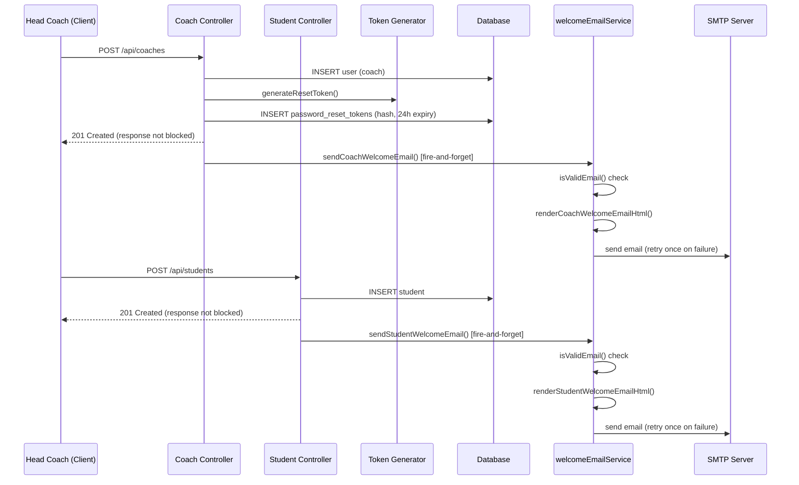

# Design Document: Coach & Student Welcome Emails

## Overview

This feature extends the existing `welcomeEmailService.ts` to send branded welcome emails when assistant coaches and students are created. Coach emails include a password-reset link for first-time onboarding; student emails are informational (no password reset) and address the guardian when the student is under 18.

The design reuses the established patterns: the nodemailer SMTP transporter, the `isValidEmail` utility, the retry-once strategy, and the LoveAll branded HTML template layout already present in the center welcome email.

## Architecture



Key architectural decisions:
- **Extend, don't create**: Both new functions live in `welcomeEmailService.ts` alongside the existing center welcome email, sharing the transporter instance and validation utility.
- **Fire-and-forget**: Email sending is triggered with a floating promise (no `await` in the controller) so API responses are never blocked.
- **Token only for coaches**: Students don't have user accounts, so no password reset token is generated for them.

## Components and Interfaces

### New Exported Functions (in `welcomeEmailService.ts`)

```typescript
// --- Coach Welcome Email ---

interface SendCoachWelcomeEmailParams {
  coachEmail: string;
  coachName: string;
  coachUsername: string;
  centerName: string;
  resetLink: string;
  loginUrl: string;
  centerId?: string;
}

export function renderCoachWelcomeEmailHtml(params: {
  coachName: string;
  coachUsername: string;
  centerName: string;
  resetLink: string;
  loginUrl: string;
}): string;

export async function sendCoachWelcomeEmail(
  params: SendCoachWelcomeEmailParams
): Promise<void>;

// --- Student Welcome Email ---

interface SendStudentWelcomeEmailParams {
  studentEmail: string;
  studentName: string;
  centerName: string;
  batchName?: string;
  centerContactInfo: string;
  guardianName?: string;
  isMinor: boolean;
  centerId?: string;
}

export function renderStudentWelcomeEmailHtml(params: {
  studentName: string;
  centerName: string;
  batchName?: string;
  centerContactInfo: string;
  guardianName?: string;
  isMinor: boolean;
}): string;

export async function sendStudentWelcomeEmail(
  params: SendStudentWelcomeEmailParams
): Promise<void>;
```

### Controller Integration Points

**`src/controllers/coaches.ts` — `createCoach`**

After the successful INSERT, the controller will:
1. Generate a reset token via `generateResetToken()`
2. Store `hashToken(token)` in `password_reset_tokens` with 24-hour expiry
3. Build the reset link: `${FRONTEND_URL}/reset-password?token=${token}`
4. Build the login URL: `${FRONTEND_URL}/login`
5. Call `sendCoachWelcomeEmail(...)` without `await` (fire-and-forget)
6. Skip steps 1-5 if the coach has no email address

**`src/controllers/students.ts` — `createStudent`**

After the successful INSERT, the controller will:
1. Determine if the student is a minor (`age < 18`)
2. Call `sendStudentWelcomeEmail(...)` without `await` (fire-and-forget)
3. Skip if the student has no email address

### Shared Utilities (reused, no changes needed)

- `src/utils/tokenGenerator.ts` — `generateResetToken()`, `hashToken()`
- `isValidEmail()` — already internal to `welcomeEmailService.ts`
- nodemailer transporter — already instantiated in `welcomeEmailService.ts`

## Data Models

### Existing Table: `password_reset_tokens`

```sql
-- No schema changes needed. Used as-is for coach tokens.
-- Columns: user_id, token_hash, expires_at
```

The coach controller will insert a row:
```sql
INSERT INTO password_reset_tokens (user_id, token_hash, expires_at)
VALUES ($1, $2, NOW() + INTERVAL '24 hours')
```

### No New Tables

Student welcome emails are purely informational — no token storage needed.

## Correctness Properties

*A property is a characteristic or behavior that should hold true across all valid executions of a system — essentially, a formal statement about what the system should do. Properties serve as the bridge between human-readable specifications and machine-verifiable correctness guarantees.*

### Property 1: Coach Email Content Round-Trip

*For any* valid coach parameters (coachName, coachUsername, centerName, resetLink, loginUrl), rendering the coach welcome email HTML and parsing the output SHALL produce a document that contains all five provided input values.

**Validates: Requirements 3.1, 3.2, 3.3, 7.3**

### Property 2: Student Email Content Round-Trip

*For any* valid student parameters (studentName, centerName, batchName when provided, centerContactInfo), rendering the student welcome email HTML and parsing the output SHALL produce a document that contains all provided input values.

**Validates: Requirements 4.1, 4.2, 4.4, 4.5, 7.3**

### Property 3: Guardian Addressing for Minors

*For any* student email rendered with `isMinor = true` and a provided `guardianName`, the greeting in the rendered HTML SHALL address the guardian name rather than the student name directly.

**Validates: Requirements 2.4, 4.6**

### Property 4: Brand Consistency

*For any* rendered email (coach or student), the HTML output SHALL contain the dark header color (#111827), the LoveAll lime green (#B8E135), the card background (#F9FAFB), the border color (#E5E7EB), the font stack (`-apple-system, BlinkMacSystemFont, 'Segoe UI', Roboto, sans-serif`), and the 600px max-width container.

**Validates: Requirements 3.5, 5.1, 5.2, 5.4**

### Property 5: Email Validation Rejects Invalid Formats

*For any* string that is empty, whitespace-only, lacks an `@` character, or has no `.` in the domain portion, the email validation function SHALL return false and the send function SHALL skip delivery without throwing.

**Validates: Requirements 6.3**

## Error Handling

| Scenario | Behavior |
|----------|----------|
| Coach has no email address | Skip email entirely, log nothing (normal path) |
| Student has no email address | Skip email entirely, log nothing (normal path) |
| Email fails validation (`isValidEmail` returns false) | Log warning with recipient type + centerId, return without throwing |
| First SMTP send attempt fails | Wait 5 seconds, retry once |
| Retry also fails | Log error with recipient type + identifier, return without throwing |
| Token generation/storage fails | Log error, do NOT block the API response (fire-and-forget wraps everything) |
| FRONTEND_URL env var missing | Use a fallback URL or log warning and skip email |

Design rationale: Welcome emails are important but non-critical. A failure in email delivery must never prevent the core operation (coach/student creation) from succeeding.

## Testing Strategy

### Property-Based Tests (via fast-check)

Each property test runs a minimum of 100 iterations with randomly generated inputs:

- **Property 1** — Generate random strings for coachName, coachUsername, centerName, resetLink, loginUrl → render → verify all values present in HTML output
- **Property 2** — Generate random strings for studentName, centerName, batchName, centerContactInfo → render → verify all values present in HTML output
- **Property 3** — Generate random guardianName strings, render with `isMinor: true` → verify greeting contains guardianName
- **Property 4** — Generate random valid params for both renderers → verify brand colors/fonts present
- **Property 5** — Generate random invalid email strings (empty, whitespace, no @, no domain dot) → verify `isValidEmail` returns false

Tag format: `Feature: coach-student-welcome-emails, Property {N}: {title}`

### Unit Tests (example-based)

- Coach controller integration: mock email service, verify it's called with correct params when email is present
- Coach controller skip: verify email service NOT called when email is absent
- Student controller integration: mock email service, verify it's called with correct params
- Student controller skip: verify email service NOT called when email is absent
- Async fire-and-forget: mock email service to throw, verify API still returns 201
- Token storage: verify `password_reset_tokens` row is created with correct hash and 24h expiry
- Retry logic: mock transporter to fail once then succeed → two calls made
- Double failure: mock transporter to always fail → error logged, no exception

### Integration Tests

- End-to-end coach creation with SMTP (test environment): verify email arrives with correct subject and content
- End-to-end student creation: verify email arrives when email is provided

### What Is NOT Property-Tested

- Controller wiring (integration concern)
- Retry timing (side-effect behavior)
- Token storage in DB (integration concern)
- Static content like the checklist items (example-based test suffices)
