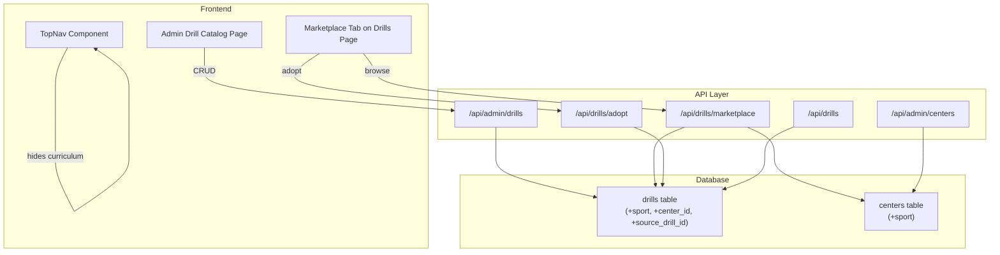

# Design Document: Drill Marketplace

## Overview

The Drill Marketplace introduces a two-tier drill system: platform-level **Global Drills** managed by the ADMIN, and center-scoped **Center Drills** owned by individual centers. Centers browse a sport-filtered marketplace of global drills and adopt them into their local library as independent copies. The feature also adds a `sport` dimension to both drills and centers, enabling automatic content relevance filtering.

Key capabilities:
- Admin CRUD for a master drill catalog (Global Drills with `center_id = NULL`)
- Sport tagging on drills and centers
- Marketplace endpoint that auto-filters by center sport and excludes already-adopted drills
- Adoption flow that copies a global drill into a center's library with lineage tracking
- Hiding the `/curriculum` route from center navigation while preserving the code
- Database migration preserving existing data with backward-compatible schema changes

## Architecture



### Design Decisions

1. **Global drills use `center_id = NULL`** rather than a separate table. This keeps the schema simple and lets existing queries naturally exclude globals via the `center_id = $centerId` filter already in place.

2. **Adoption creates a full copy** with `source_drill_id` referencing the original. This ensures centers can freely edit adopted drills without affecting the master catalog or other centers.

3. **Sport is stored as a VARCHAR with CHECK constraint** rather than a separate lookup table. The list of supported sports is small and stable (badminton, tennis, table_tennis, squash). A CHECK constraint provides validation without join overhead.

4. **Marketplace filtering happens server-side**. The endpoint looks up the center's sport, then queries global drills matching that sport (or all drills if sport is NULL), excluding IDs already adopted by the center.

5. **Curriculum route hidden via navigation config**, not route removal. The React Router entry remains but the TopNav config array excludes it. Direct URL access redirects to /dashboard.

## Components and Interfaces

### API Endpoints

#### Admin Drill CRUD (`/api/admin/drills`)

| Method | Path | Description | Auth |
|--------|------|-------------|------|
| GET | `/api/admin/drills` | List global drills (filterable by sport, category, search) | ADMIN |
| POST | `/api/admin/drills` | Create a global drill | ADMIN |
| PATCH | `/api/admin/drills/:id` | Update a global drill | ADMIN |
| DELETE | `/api/admin/drills/:id` | Archive a global drill (soft-delete) | ADMIN |

#### Marketplace & Adoption (`/api/drills/*`)

| Method | Path | Description | Auth |
|--------|------|-------------|------|
| GET | `/api/drills/marketplace` | Browse global drills filtered by center sport | HEAD_COACH, ASSISTANT_COACH |
| POST | `/api/drills/adopt` | Adopt a global drill into center library | HEAD_COACH |

#### Center Sport (`/api/admin/centers`)

Existing `POST /api/admin/centers` and `PATCH /api/admin/centers/:id` gain a `sport` field in the allowed parameters.

### Backend Components

```
src/
├── controllers/
│   ├── admin/
│   │   └── drills.ts          # Admin CRUD for global drills
│   └── drills.ts              # Extended: marketplace + adopt handlers
├── routes/
│   ├── admin.ts               # Extended: mount admin drill routes
│   └── drills.ts              # Extended: marketplace + adopt routes
├── validators/
│   └── drill.schemas.ts       # Extended: sport field, adopt schema, marketplace query
├── migrations/
│   └── 024_drill_marketplace.sql  # Schema changes
└── types/
    └── index.ts               # Extended: Sport enum, updated Drill interface
```

### Frontend Components

```
src/
├── components/
│   ├── TopNav.tsx             # Modified: remove curriculum from COACH_NAV
│   ├── MarketplaceTab.tsx     # New: marketplace browsing + adopt UI
│   └── AdminDrillCatalog.tsx  # New: admin drill management page
├── pages/
│   ├── DrillsPage.tsx         # Modified: add marketplace tab for HEAD_COACH
│   └── AdminDrillCatalogPage.tsx  # New: admin page wrapping the catalog
├── hooks/
│   ├── useMarketplace.ts      # New: fetch marketplace drills
│   └── useAdminDrills.ts      # New: admin drill CRUD operations
└── constants/
    └── sports.ts              # New: SUPPORTED_SPORTS constant
```

## Data Models

### Schema Changes (Migration 024)

```sql
-- Add sport column to drills table
ALTER TABLE drills ADD COLUMN IF NOT EXISTS sport VARCHAR(30) NOT NULL DEFAULT 'badminton'
  CHECK (sport IN ('badminton', 'tennis', 'table_tennis', 'squash'));

-- Add center_id to drills (nullable FK → centers)
ALTER TABLE drills ADD COLUMN IF NOT EXISTS center_id VARCHAR(50)
  REFERENCES centers(id) ON DELETE SET NULL;

-- Add source_drill_id for adoption lineage tracking
ALTER TABLE drills ADD COLUMN IF NOT EXISTS source_drill_id VARCHAR(50)
  REFERENCES drills(id) ON DELETE SET NULL;

-- Add sport column to centers table
ALTER TABLE centers ADD COLUMN IF NOT EXISTS sport VARCHAR(30)
  CHECK (sport IN ('badminton', 'tennis', 'table_tennis', 'squash'));

-- Index for marketplace queries (global drills by sport)
CREATE INDEX IF NOT EXISTS idx_drills_sport ON drills(sport);
CREATE INDEX IF NOT EXISTS idx_drills_center_id ON drills(center_id);
CREATE INDEX IF NOT EXISTS idx_drills_source_drill_id ON drills(source_drill_id);

-- Set existing drills to 'badminton' (migration default handles this)
-- Existing drills already have center_id from tenant scope usage
```

### Updated Drill Interface

```typescript
export interface Drill {
  id: string;
  name: string;
  description: string;
  category: string;
  sport: Sport;
  centerId: string | null;       // NULL = global drill
  sourceDrillId: string | null;  // NULL = original, non-null = adopted from global
  isArchived: boolean;
  createdAt: Date;
  updatedAt: Date;
}

export type Sport = 'badminton' | 'tennis' | 'table_tennis' | 'squash';

export const SUPPORTED_SPORTS: Sport[] = ['badminton', 'tennis', 'table_tennis', 'squash'];
```

### Updated Center Interface (addition)

```typescript
export interface Center {
  // ...existing fields...
  sport: Sport | null;  // null = show all sports in marketplace
}
```

### Request/Response Types

```typescript
// Admin drill creation
export interface CreateGlobalDrillRequest {
  name: string;
  description: string;
  category: string;
  sport: Sport;
}

// Marketplace query
export interface MarketplaceQuery {
  category?: string;
  search?: string;
}

// Adoption request
export interface AdoptDrillRequest {
  drillId: string;  // ID of the global drill to adopt
}

// Adoption response
export interface AdoptDrillResponse {
  id: string;       // ID of the newly created center drill
  name: string;
  description: string;
  category: string;
  sport: Sport;
  sourceDrillId: string;
}
```

## Correctness Properties

*A property is a characteristic or behavior that should hold true across all valid executions of a system — essentially, a formal statement about what the system should do. Properties serve as the bridge between human-readable specifications and machine-verifiable correctness guarantees.*

### Property 1: Sport Validation

*For any* drill creation or update request (admin or center), the system SHALL accept the sport value only if it belongs to the predefined set `['badminton', 'tennis', 'table_tennis', 'squash']`, and SHALL reject any other string value.

**Validates: Requirements 2.2, 2.3**

### Property 2: Global Drill Creation Round-Trip

*For any* valid drill creation payload submitted via the admin API (with valid name, description, category, and sport), the stored record SHALL have `center_id = NULL` and its name, description, category, and sport SHALL exactly match the input values.

**Validates: Requirements 3.2, 3.3**

### Property 3: Global/Adopted Drill Isolation

*For any* global drill that has been adopted by one or more centers, modifications to the global drill (update or archive) SHALL NOT alter any field on the adopted center drill records, and modifications to adopted center drills SHALL NOT alter the source global drill.

**Validates: Requirements 3.4, 3.5, 6.5**

### Property 4: Admin List Filtering Correctness

*For any* combination of sport filter, category filter, and name search applied to the admin drill list endpoint, all returned drills SHALL match every active filter criterion, and no drill matching all criteria SHALL be excluded from the results.

**Validates: Requirements 3.6, 3.7**

### Property 5: Marketplace Sport Filtering

*For any* center requesting the marketplace, if the center has a configured sport, the system SHALL return only global drills matching that sport; if the center has no sport configured (NULL), the system SHALL return all non-archived global drills regardless of sport.

**Validates: Requirements 5.2, 7.4**

### Property 6: Marketplace Excludes Adopted Drills

*For any* center that has previously adopted one or more global drills, the marketplace response SHALL never include any global drill whose ID matches the `source_drill_id` of an existing center drill owned by that center.

**Validates: Requirements 5.5**

### Property 7: Adoption Copies Fields with Lineage

*For any* global drill that is adopted by a center, the resulting center drill SHALL have `center_id` equal to the adopting center's ID, `source_drill_id` equal to the global drill's ID, and name, description, category, sport values identical to the source global drill at the time of adoption.

**Validates: Requirements 6.2, 6.3**

### Property 8: Adoption Idempotence Rejection

*For any* center that has already adopted a specific global drill, attempting to adopt the same global drill again SHALL return an error and SHALL NOT create a duplicate center drill record.

**Validates: Requirements 6.4**

### Property 9: Tenant Read Isolation

*For any* center making a request to `GET /api/drills`, all returned drills SHALL have a non-null `center_id` matching the requesting center's ID. No global drills (`center_id = NULL`) and no drills from other centers SHALL appear in the response.

**Validates: Requirements 9.1, 9.5**

### Property 10: Tenant Write Isolation

*For any* drill creation via `POST /api/drills`, the resulting record SHALL have `center_id` equal to the requesting center's ID. For any update or archive via `PATCH/DELETE /api/drills/:id`, the operation SHALL succeed only if the target drill's `center_id` matches the requesting center's ID.

**Validates: Requirements 9.2, 9.3, 9.4**

## Error Handling

| Scenario | HTTP Status | Error Message |
|----------|-------------|---------------|
| Invalid sport value in drill creation/update | 400 | "Sport must be one of: badminton, tennis, table_tennis, squash" |
| Missing required fields (name, description, category, sport) | 400 | Field-specific validation error from Zod |
| Attempt to adopt already-adopted drill | 409 | "This drill has already been adopted by your center" |
| Attempt to adopt non-existent or archived global drill | 404 | "Drill not found or is no longer available" |
| Non-ADMIN accessing admin drill endpoints | 403 | "Insufficient permissions" |
| Non-HEAD_COACH attempting adoption | 403 | "Insufficient permissions" |
| Center not found when resolving sport for marketplace | 500 | "Failed to resolve center configuration" |
| Database constraint violation on sport CHECK | 400 | "Invalid sport value" |

## Testing Strategy

### Property-Based Tests (PBT)

Property-based testing is well-suited for this feature because the core logic involves filtering, data copying, and validation — all pure functions or functions with clear input/output behavior where input variation reveals edge cases.

**Library**: `fast-check` (TypeScript, already common in Node.js projects)
**Configuration**: Minimum 100 iterations per property test

Tests to implement:
1. **Sport validation property** — Generate random strings; verify only valid sports pass validation
2. **Global drill creation round-trip** — Generate valid payloads; verify stored data matches input with NULL center_id
3. **Isolation property** — Generate update payloads for global drills with adopted copies; verify no cross-contamination
4. **Admin filtering property** — Generate drill collections + filter params; verify result correctness
5. **Marketplace sport filtering** — Generate centers with various sport values + drill collections; verify filtering
6. **Marketplace exclusion property** — Generate adoption histories; verify adopted drills excluded
7. **Adoption copy correctness** — Generate global drills; verify adopted copy matches source
8. **Adoption idempotence** — Generate pre-adopted state; verify second adoption fails
9. **Tenant read isolation** — Generate mixed drill sets (global + multi-center); verify only center's drills returned
10. **Tenant write isolation** — Generate cross-center operations; verify rejection

Each test tagged as: `Feature: drill-marketplace, Property {N}: {property_text}`

### Unit Tests (Example-Based)

- Curriculum route removal from navigation config
- Redirect from `/curriculum` to `/dashboard`
- Admin center creation/update with sport parameter
- Marketplace UI renders drill cards with adopt button
- Adoption success toast/feedback
- Admin drill catalog page structure

### Integration Tests

- Full admin drill CRUD lifecycle (create → list → update → archive)
- Marketplace browsing → adoption → drill appears in center library
- Migration correctness (run on test database, verify schema + data)
- Existing drill endpoints continue working unchanged after migration

### Migration Testing

- Verify `sport` column added with default `'badminton'`
- Verify `center_id` column added (nullable)
- Verify `source_drill_id` column added (nullable)
- Verify existing drill records preserve all fields unchanged
- Verify new indexes created
