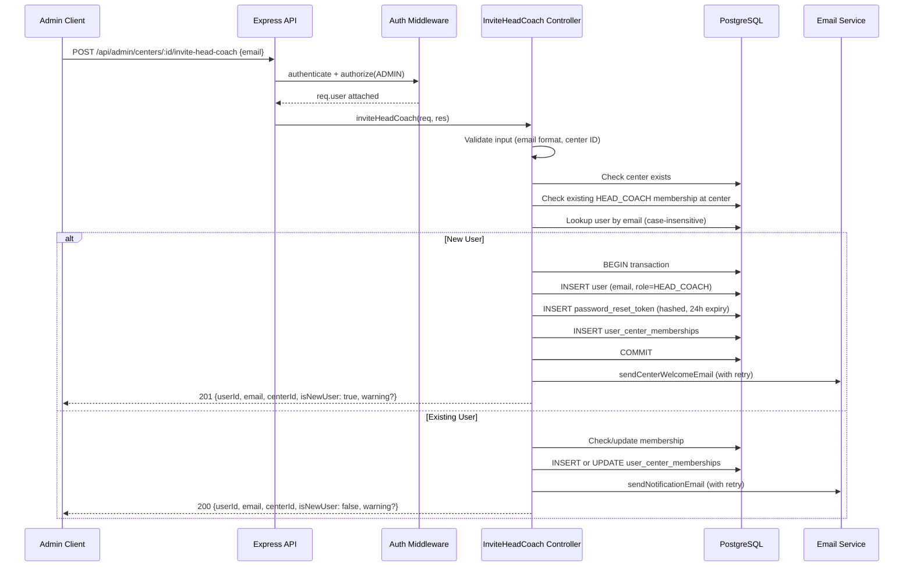

# Design Document: Head Coach Invite

## Overview

This feature replaces the existing fire-and-forget `invite-coach` and `reset-coach-password` admin endpoints with a single smart invite endpoint (`POST /api/admin/centers/:id/invite-head-coach`) that handles both new and existing users, plus a dedicated re-send reset endpoint (`POST /api/admin/centers/:id/resend-head-coach-reset`). The key behavioral change: the endpoint accepts an **email address** (not a pre-assigned head_coach_id) and determines the correct flow based on whether the email matches an existing user.

Multi-center access is managed via the `user_center_memberships` table — inviting creates a membership row rather than updating `users.center_id`.

### Design Decisions

| Decision | Rationale |
|----------|-----------|
| Single endpoint handles both flows | Simpler admin UI — one button, one input, consistent UX |
| DB writes before email delivery | Data integrity: user/membership persist even if SMTP fails |
| Retry email once with 5s delay | Balance between resilience and response time |
| Case-insensitive email lookup | Prevent duplicate accounts from mixed-case input |
| 409 for existing head coach at center | Explicit conflict signals; admin must unassign first |
| Role upgrade for existing membership | Avoid duplicate rows when user already has a different role |

## Architecture



## Components and Interfaces

### New Controller: `src/controllers/admin/headCoachInvite.ts`

```typescript
// POST /api/admin/centers/:id/invite-head-coach
export async function inviteHeadCoach(req: AuthRequest, res: Response): Promise<void>;

// POST /api/admin/centers/:id/resend-head-coach-reset
export async function resendHeadCoachReset(req: AuthRequest, res: Response): Promise<void>;
```

### Route Registration (in `src/routes/admin.ts`)

```typescript
router.post('/centers/:id/invite-head-coach', inviteHeadCoach);
router.post('/centers/:id/resend-head-coach-reset', resendHeadCoachReset);
```

### Extended Email Service: `src/services/welcomeEmailService.ts`

A new `sendHeadCoachNotificationEmail` function for the existing-user flow (no reset link, just login URL and center name):

```typescript
export async function sendHeadCoachNotificationEmail(params: {
  email: string;
  userName: string;
  centerName: string;
  loginUrl: string;
  centerId?: string;
}): Promise<void>;
```

### Utility: Email validation helper

Reuse the existing `isValidEmail` function from `welcomeEmailService.ts`, or extract to a shared `src/utils/validation.ts`:

```typescript
export function isValidEmailFormat(email: string): boolean;
export function isValidUUID(id: string): boolean;
```

### Existing Services Used

| Service | Usage |
|---------|-------|
| `src/utils/tokenGenerator.ts` | `generateResetToken()`, `hashToken()` |
| `src/services/welcomeEmailService.ts` | `sendCenterWelcomeEmail()` |
| `src/services/membershipService.ts` | `createMembership()` — used as reference, but controller will use raw SQL for transactional control |
| `src/config/database.ts` | `query()` for all DB operations |
| `src/middleware/auth.ts` | `authenticate`, `authorize(UserRole.ADMIN)` |

## Data Models

### Database Tables Involved

**`users`** (existing)
```sql
-- Relevant columns:
id UUID PRIMARY KEY,
email VARCHAR(255),
username VARCHAR(255),
name VARCHAR(255),
password_hash VARCHAR(255) NULL,  -- NULL for new users via invite
role VARCHAR(20),
center_id UUID NULL,              -- Legacy, nullable after migration 017
created_at TIMESTAMP
```

**`user_center_memberships`** (existing, from migration 017)
```sql
id UUID PRIMARY KEY DEFAULT gen_random_uuid(),
user_id UUID NOT NULL REFERENCES users(id),
center_id UUID NOT NULL REFERENCES centers(id),
role VARCHAR(20) NOT NULL CHECK (role IN ('HEAD_COACH','ASSISTANT_COACH','STUDENT')),
can_access_fees BOOLEAN DEFAULT false,
created_at TIMESTAMP NOT NULL DEFAULT NOW()
-- UNIQUE(user_id, center_id, role)
```

**`password_reset_tokens`** (existing)
```sql
id UUID PRIMARY KEY,
user_id UUID NOT NULL REFERENCES users(id),
token_hash VARCHAR(255) NOT NULL,
expires_at TIMESTAMP NOT NULL,
created_at TIMESTAMP DEFAULT NOW()
```

**`centers`** (existing)
```sql
id UUID PRIMARY KEY,
name VARCHAR(255),
head_coach_id UUID NULL REFERENCES users(id),
-- ... other fields
```

### Request/Response Interfaces

```typescript
// POST /api/admin/centers/:id/invite-head-coach
interface InviteHeadCoachRequest {
  email: string; // Required, valid email format, max 254 chars
}

interface InviteHeadCoachResponse {
  userId: string;
  email: string;
  centerId: string;
  isNewUser: boolean;
  warning?: string; // Present only if email delivery failed
}

// POST /api/admin/centers/:id/resend-head-coach-reset
// No request body — uses center's assigned head coach

interface ResendResetResponse {
  email: string;
  centerId: string;
  warning?: string; // Present only if email delivery failed
}
```

### Transaction Strategy

The new-user flow requires atomicity across user creation, token insertion, and membership creation. Since the database module exposes a `query()` helper but no explicit transaction API, the controller will use raw SQL transactions:

```typescript
await query('BEGIN');
try {
  // INSERT user
  // INSERT password_reset_token
  // INSERT user_center_memberships
  await query('COMMIT');
} catch (err) {
  await query('ROLLBACK');
  throw err;
}
```

Email delivery happens **after** the COMMIT to ensure data persists regardless of email outcome.

## Correctness Properties

*A property is a characteristic or behavior that should hold true across all valid executions of a system — essentially, a formal statement about what the system should do. Properties serve as the bridge between human-readable specifications and machine-verifiable correctness guarantees.*

### Property 1: Email case normalization

*For any* valid email string with arbitrary mixed-case characters, the invite endpoint SHALL create a user with `email` and `username` fields equal to the input lowercased.

**Validates: Requirements 1.1**

### Property 2: New user token has correct hash and 24-hour expiry

*For any* new user created by the invite endpoint, the stored `password_reset_tokens` row SHALL have a `token_hash` equal to `SHA-256(rawToken)` and an `expires_at` within ±1 minute of `now + 24 hours`.

**Validates: Requirements 1.2**

### Property 3: New user invite creates user, membership, and returns 201

*For any* valid email that does not match an existing user and a valid center without an existing head coach, the invite endpoint SHALL create a user row with role HEAD_COACH, a `user_center_memberships` row linking that user to the center with role HEAD_COACH, and return HTTP 201 with `userId`, `email`, `centerId`, and `isNewUser: true`.

**Validates: Requirements 1.3, 1.5**

### Property 4: Existing user invite creates membership, returns 200, no token

*For any* valid email that matches an existing user and a valid center without an existing head coach, the invite endpoint SHALL create a `user_center_memberships` row with role HEAD_COACH, return HTTP 200 with `isNewUser: false`, and SHALL NOT create a `password_reset_tokens` row for that user.

**Validates: Requirements 2.1, 2.3, 2.4**

### Property 5: Invalid email format rejected

*For any* string that does not contain exactly one `@` followed by a domain with at least one dot, or that exceeds 254 characters, the invite endpoint SHALL return HTTP 400 without modifying any database state.

**Validates: Requirements 3.2, 1.7**

### Property 6: Invalid center ID format rejected

*For any* string in the center ID path parameter that is not a valid UUID format, the invite endpoint SHALL return HTTP 400.

**Validates: Requirements 3.3**

### Property 7: Center with existing different head coach returns 409

*For any* center that already has a `user_center_memberships` row with role HEAD_COACH for a different user, the invite endpoint SHALL return HTTP 409 and not create any new membership.

**Validates: Requirements 4.1**

### Property 8: User already head coach of same center returns 409

*For any* user who already has a `user_center_memberships` row with role HEAD_COACH at the target center, re-invoking the invite endpoint with that user's email SHALL return HTTP 409.

**Validates: Requirements 4.2**

### Property 9: Existing membership role upgrade

*For any* user who has a `user_center_memberships` row at the target center with a role other than HEAD_COACH (e.g., ASSISTANT_COACH), the invite endpoint SHALL update the existing row's role to HEAD_COACH rather than inserting a duplicate row.

**Validates: Requirements 4.3**

### Property 10: Transactional rollback on failure

*For any* failure during user creation, token generation, or membership insertion in the new-user flow, the invite endpoint SHALL leave zero new rows in `users`, `password_reset_tokens`, and `user_center_memberships` (rollback) and return HTTP 500.

**Validates: Requirements 1.6**

### Property 11: Data persisted regardless of email outcome

*For any* successful invite (new or existing user), the user account and `user_center_memberships` row SHALL exist in the database even if the email delivery fails on both attempts, and the response SHALL still indicate success (201 or 200).

**Validates: Requirements 7.2, 7.4**

### Property 12: Reset endpoint invalidates old tokens and creates fresh 24-hour token

*For any* center with an assigned head coach, invoking the resend-reset endpoint SHALL delete all existing `password_reset_tokens` for that user and insert exactly one new token with `expires_at` within ±1 minute of `now + 24 hours`.

**Validates: Requirements 5.1**

## Error Handling

| Scenario | HTTP Status | Response Body |
|----------|-------------|---------------|
| Missing/empty email | 400 | `{ error: "Email is required" }` |
| Invalid email format / >254 chars | 400 | `{ error: "Invalid email format" }` |
| Invalid center ID format (non-UUID) | 400 | `{ error: "Invalid center ID" }` |
| Center not found | 404 | `{ error: "Center not found" }` |
| No auth token / invalid / expired | 401 | `{ error: "No token provided" }` or `{ error: "Invalid or expired token" }` |
| Non-ADMIN role | 403 | `{ error: "You do not have permission to perform this action" }` |
| Center already has a different head coach | 409 | `{ error: "A head coach is already assigned to this center" }` |
| User already head coach of this center | 409 | `{ error: "This user is already the head coach of this center" }` |
| Transaction failure (new user flow) | 500 | `{ error: "Could not process invite" }` |
| No head coach assigned (reset endpoint) | 422 | `{ error: "No head coach is assigned to this center" }` |
| Email failed after retry | 201/200 | Normal success + `{ warning: "Email could not be delivered" }` |

### Email Retry Logic

```
attempt 1 → success → return normally
attempt 1 → fail → wait 5s → attempt 2 → success → return normally
attempt 1 → fail → wait 5s → attempt 2 → fail → return success + warning field
```

Maximum total request duration: 45 seconds (30s email timeout × 1 attempt + 5s delay + buffer).

## Testing Strategy

### Property-Based Tests (PBT)

Library: **fast-check** (TypeScript PBT library)
Minimum iterations: 100 per property

Each correctness property (1–12) will be implemented as a property-based test with:
- Randomized email strings (valid and invalid)
- Randomized center IDs (valid UUIDs and invalid formats)
- Randomized user existence states (mocked DB)
- Tag format: `Feature: head-coach-invite, Property N: <title>`

Core properties to test with PBT:
- Property 1: Email normalization (generate random mixed-case emails)
- Property 2: Token hash + expiry correctness
- Property 5: Invalid email rejection (generate random non-email strings)
- Property 6: Invalid UUID rejection (generate random non-UUID strings)
- Property 10: Rollback guarantee (inject failures at random steps)
- Property 11: Data persistence despite email failure

### Unit Tests (Example-Based)

- Auth middleware returns 401/403 for missing/invalid tokens and wrong roles
- Reset endpoint returns 422 when no head coach exists
- Reset endpoint returns 404 for non-existent center
- Email retry returns warning field when both attempts fail
- Conflict detection: 409 for duplicate head coach scenarios

### Integration Tests

- Full invite flow with real DB (test container or Supabase local)
- Email delivery verification with mock SMTP (e.g., Ethereal or MailHog)
- Transaction rollback verified by checking DB state after induced failure

### Test Dependencies

- **fast-check**: Property-based test generation
- **vitest** or existing test runner: Test framework
- Mock for `query()` in unit tests to isolate controller logic
- Mock for email transport to verify retry behavior without real SMTP
