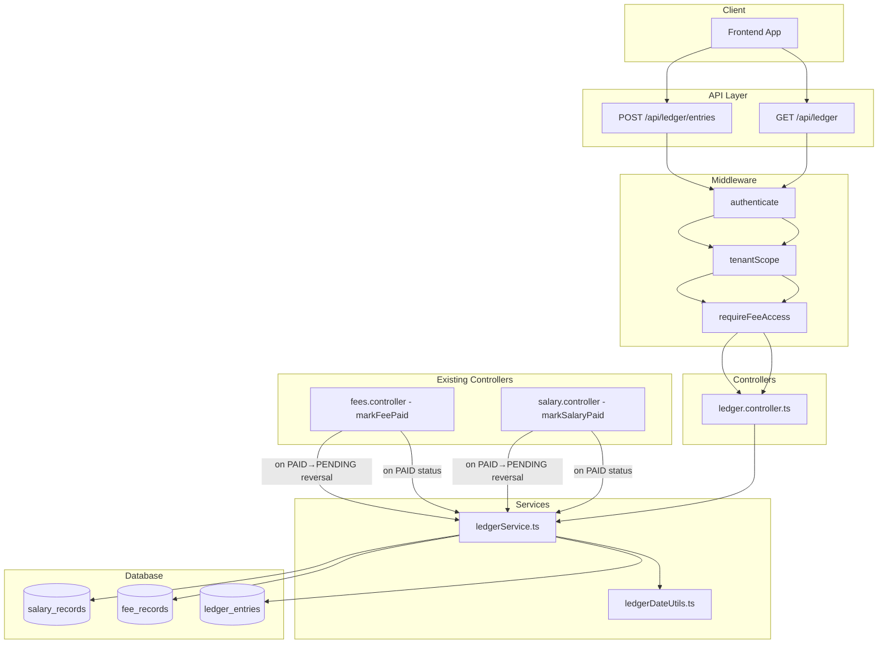

# Design Document: Student Fee Ledger

## Overview

The Student Fee Ledger introduces a unified financial ledger for each center, tracking all monetary transactions — fee payments received from students (credits) and salary disbursements to coaches (debits). The system automatically creates ledger entries when fee or salary statuses change to PAID, and supports reversal entries when payments are cancelled. It also supports manual entries for miscellaneous income/expenses. A query API provides filtering by time period (month, quarter, Indian financial year, custom range), by student, and by coach, with running balance computation.

### Key Design Decisions

1. **Event-driven entry creation**: Ledger entries are created as a side-effect of fee/salary status changes within the same transaction, ensuring atomicity.
2. **Immutable entries**: Ledger entries are never updated or deleted — corrections use reversal entries to maintain a complete audit trail.
3. **Running balance computed at query time**: Rather than storing running balance (which creates race conditions), it's computed via SQL window functions during reads.
4. **Indian Financial Year alignment**: All quarter/year logic uses April–March boundaries (Q1=Apr-Jun, Q2=Jul-Sep, Q3=Oct-Dec, Q4=Jan-Mar).
5. **Existing middleware reuse**: Leverages `authenticate`, `tenantScope`, and `requireFeeAccess` middleware for authorization and multi-tenant scoping.

## Architecture



## Components and Interfaces

### 1. Database Migration (`021_ledger_entries.sql`)

Creates the `ledger_entries` table and supporting indexes.

### 2. Ledger Service (`src/services/ledgerService.ts`)

Core business logic for creating and querying ledger entries.

**Public Methods:**
- `createCreditEntry(feeRecord, studentName, centerId)` — Creates a CREDIT entry from a paid fee
- `createDebitEntry(salaryRecord, coachName, centerId)` — Creates a DEBIT entry from a paid salary
- `createReversalEntry(originalEntryRef, centerId)` — Creates a reversal entry (opposite type)
- `createManualEntry(params, centerId)` — Creates a manual CREDIT or DEBIT entry
- `queryLedger(filters, centerId)` — Queries ledger with time/person filters, computes running balance
- `hasDuplicateEntry(referenceType, referenceId, entryType, centerId)` — Checks for duplicate prevention

### 3. Date Utilities (`src/utils/ledgerDateUtils.ts`)

Pure functions for Indian financial year date range calculations.

**Public Functions:**
- `getMonthRange(monthStr: string)` — Returns `{start, end}` for `YYYY-MM`
- `getQuarterRange(quarter: string, financialYear: string)` — Returns `{start, end}` for quarter within FY
- `getFinancialYearRange(financialYear: string)` — Returns `{start, end}` for `YYYY-YYYY`
- `validateDateRange(fromDate: string, toDate: string)` — Validates custom range
- `parseFinancialYear(fy: string)` — Parses and validates `YYYY-YYYY` format

### 4. Ledger Controller (`src/controllers/ledger.ts`)

HTTP handler for the Balance Sheet API and manual entry creation.

**Endpoints:**
- `GET /api/ledger` — Query ledger with filters
- `POST /api/ledger/entries` — Create manual ledger entry

### 5. Ledger Routes (`src/routes/ledger.ts`)

Route definitions with middleware chain.

### 6. Validation Schemas (`src/validators/ledger.schemas.ts`)

Zod schemas for request validation.

### 7. Types (`src/types/index.ts` additions)

New enums and interfaces for ledger domain.

### 8. Modified Fee Controller

The existing `markFeePaid` function in `src/controllers/fees.ts` will be augmented to call `ledgerService.createCreditEntry` after a successful status update. Similarly for reversal when status changes from PAID back to PENDING/OVERDUE.

## Data Models

### `ledger_entries` Table

| Column | Type | Constraints | Description |
|--------|------|-------------|-------------|
| id | UUID | PRIMARY KEY, DEFAULT gen_random_uuid() | Entry identifier |
| center_id | UUID | NOT NULL, FK → centers.id | Tenant scoping |
| entry_type | VARCHAR(10) | NOT NULL, CHECK IN ('CREDIT','DEBIT') | Transaction type |
| amount | NUMERIC(12,2) | NOT NULL, CHECK > 0 | Transaction amount in INR |
| transaction_date | DATE | NOT NULL | Date of the transaction |
| description | TEXT | NOT NULL | Human-readable description |
| reference_type | VARCHAR(10) | NOT NULL, CHECK IN ('FEE','SALARY','MANUAL') | Source type |
| reference_id | UUID | NULLABLE | Source record ID (fee_records.id or salary_records.id or original ledger_entries.id for reversals) |
| person_id | UUID | NULLABLE | Student or coach UUID |
| person_name | VARCHAR(200) | NULLABLE | Denormalized name for display |
| payment_method | VARCHAR(20) | NULLABLE | CASH, UPI, BANK_TRANSFER |
| category | VARCHAR(100) | NULLABLE | For manual entries (e.g., "Equipment", "Extra Classes") |
| created_at | TIMESTAMPTZ | NOT NULL, DEFAULT NOW() | Record creation timestamp |

**Indexes:**
- `idx_ledger_entries_center_date` — (center_id, transaction_date) for time-range queries
- `idx_ledger_entries_center_person` — (center_id, person_id) for person filtering
- `idx_ledger_entries_reference` — (center_id, reference_type, reference_id) for duplicate checks
- `idx_ledger_entries_created_at` — (center_id, created_at) for ordering tiebreaker

**Unique Constraint:**
- `uq_ledger_entries_ref` — UNIQUE(center_id, reference_type, reference_id, entry_type) WHERE reference_type != 'MANUAL' — Prevents duplicate auto-generated entries

### TypeScript Types

```typescript
export enum LedgerEntryType {
  CREDIT = 'CREDIT',
  DEBIT = 'DEBIT',
}

export enum LedgerReferenceType {
  FEE = 'FEE',
  SALARY = 'SALARY',
  MANUAL = 'MANUAL',
}

export interface LedgerEntry {
  id: string;
  centerId: string;
  entryType: LedgerEntryType;
  amount: number;
  transactionDate: string; // YYYY-MM-DD
  description: string;
  referenceType: LedgerReferenceType;
  referenceId?: string;
  personId?: string;
  personName?: string;
  paymentMethod?: string;
  category?: string;
  createdAt: Date;
}

export interface LedgerQueryFilters {
  month?: string;           // YYYY-MM
  quarter?: string;         // Q1, Q2, Q3, Q4
  financialYear?: string;   // YYYY-YYYY
  fromDate?: string;        // YYYY-MM-DD
  toDate?: string;          // YYYY-MM-DD
  studentId?: string;
  coachId?: string;
}

export interface LedgerQueryResult {
  entries: (LedgerEntry & { runningBalance: number })[];
  summary: {
    totalCredits: number;
    totalDebits: number;
    netBalance: number;
    openingBalance: number;
  };
}

export interface CreateManualEntryRequest {
  entryType: LedgerEntryType;
  amount: number;
  transactionDate: string;
  description: string;
  category?: string;
  personId?: string;
  personName?: string;
}
```

### API Response Shape

```json
{
  "entries": [
    {
      "id": "uuid",
      "entryType": "CREDIT",
      "amount": 3000.00,
      "transactionDate": "2025-04-15",
      "description": "Fee payment - Rahul Sharma (April 2025)",
      "referenceType": "FEE",
      "referenceId": "fee-uuid",
      "personId": "student-uuid",
      "personName": "Rahul Sharma",
      "paymentMethod": "UPI",
      "category": null,
      "runningBalance": 3000.00,
      "createdAt": "2025-04-15T10:30:00Z"
    }
  ],
  "summary": {
    "totalCredits": 15000.00,
    "totalDebits": 5000.00,
    "netBalance": 10000.00,
    "openingBalance": 25000.00
  }
}
```


## Correctness Properties

*A property is a characteristic or behavior that should hold true across all valid executions of a system — essentially, a formal statement about what the system should do. Properties serve as the bridge between human-readable specifications and machine-verifiable correctness guarantees.*

### Property 1: Credit entry preserves fee record fields

*For any* valid fee record with status PAID, creating a credit ledger entry SHALL produce an entry where: entry_type = CREDIT, amount = fee_record.amount, transaction_date = fee_record.paid_date, reference_type = FEE, reference_id = fee_record.id, person_id = fee_record.student_id, payment_method = fee_record.payment_method, center_id = fee_record.center_id, and the description contains the student name and fee period.

**Validates: Requirements 1.1, 1.2, 1.3, 1.4, 1.6**

### Property 2: Debit entry preserves salary record fields

*For any* valid salary record with status PAID, creating a debit ledger entry SHALL produce an entry where: entry_type = DEBIT, amount = salary_record.amount, transaction_date = salary_record.payment_date, reference_type = SALARY, reference_id = salary_record.id, person_id = salary_record.coach_user_id, payment_method = salary_record.payment_method, center_id = salary_record.center_id, and the description contains the coach name and salary period.

**Validates: Requirements 2.1, 2.2, 2.3, 2.4, 2.6**

### Property 3: Entry creation is idempotent

*For any* fee record or salary record, invoking ledger entry creation multiple times for the same source record SHALL result in exactly one ledger entry existing for that (reference_type, reference_id, entry_type, center_id) combination.

**Validates: Requirements 1.5, 2.5**

### Property 4: Indian Financial Year date range correctness

*For any* valid quarter (Q1–Q4) and financial year string (YYYY-YYYY), `getQuarterRange` SHALL return a date range where Q1 maps to April 1–June 30, Q2 to July 1–September 30, Q3 to October 1–December 31, Q4 to January 1–March 31 of the following year. For `getFinancialYearRange`, the range SHALL span April 1 of the start year to March 31 of the end year.

**Validates: Requirements 5.2, 6.1**

### Property 5: Date filtering returns exactly matching entries

*For any* set of ledger entries and any valid time filter (month, quarter, financial year, or custom date range), the query SHALL return exactly those entries whose transaction_date falls within the computed date range (inclusive), and no entries outside it.

**Validates: Requirements 4.1, 5.1, 7.1**

### Property 6: Summary totals equal aggregation of filtered entries

*For any* filtered result set, totalCredits SHALL equal the sum of amounts where entry_type = CREDIT, totalDebits SHALL equal the sum of amounts where entry_type = DEBIT, and netBalance SHALL equal totalCredits minus totalDebits.

**Validates: Requirements 4.2, 5.3, 6.2, 7.3, 8.3, 9.3**

### Property 7: Entries are chronologically ordered

*For any* query result, entries SHALL be ordered such that for consecutive entries (i, i+1): entry[i].transaction_date <= entry[i+1].transaction_date, and if dates are equal, entry[i].created_at <= entry[i+1].created_at.

**Validates: Requirements 4.3, 6.3**

### Property 8: Tenant isolation — no cross-center leakage

*For any* query executed with a given center_id, every entry in the result set SHALL have center_id equal to the requesting center's ID. No entry belonging to a different center SHALL appear in the results.

**Validates: Requirements 4.4, 5.4, 6.4, 7.4, 8.4, 9.4, 11.3**

### Property 9: Person filter returns correctly typed entries

*For any* student_id filter, all returned entries SHALL have entry_type = CREDIT and person_id = student_id. *For any* coach_id filter, all returned entries SHALL have entry_type = DEBIT and person_id = coach_id.

**Validates: Requirements 8.1, 9.1**

### Property 10: Filter composition is conjunction

*For any* combination of a person filter (student_id or coach_id) with a time-period filter, the result set SHALL be the intersection: entries that satisfy both the person filter AND the time filter simultaneously.

**Validates: Requirements 8.2, 9.2**

### Property 11: Running balance is cumulative signed sum

*For any* ordered result set with an opening_balance, the running_balance of entry[i] SHALL equal opening_balance + sum of signed amounts from entry[0] to entry[i], where CREDIT amounts are positive and DEBIT amounts are negative. The opening_balance SHALL equal the net of all center entries with transaction_date before the filter period start.

**Validates: Requirements 10.1, 10.2, 10.3**

### Property 12: Reversal creates opposite-type entry with matching amount

*For any* paid fee record that is reverted to PENDING/OVERDUE, a DEBIT reversal entry SHALL be created with the same amount and reference_id pointing to the original entry. *For any* paid salary record reverted to PENDING, a CREDIT reversal entry SHALL be created with the same amount and reference_id pointing to the original entry.

**Validates: Requirements 12.1, 12.2, 12.3**

### Property 13: Amount must be positive with two decimal precision

*For any* ledger entry creation attempt with amount <= 0, the system SHALL reject it. *For any* valid amount, the stored value SHALL have at most two decimal places.

**Validates: Requirements 3.2, 3.5**

### Property 14: Manual entry fields stored correctly

*For any* valid manual entry creation request, the resulting entry SHALL have reference_type = MANUAL, and all provided fields (entry_type, amount, transaction_date, description, category, person_id, person_name) SHALL be stored exactly as provided.

**Validates: Requirements 13.2, 13.3, 13.5, 13.7**

## Error Handling

| Scenario | HTTP Status | Error Response |
|----------|-------------|----------------|
| Missing/invalid month format (not YYYY-MM) | 400 | `{ "error": "Invalid month format. Expected YYYY-MM" }` |
| Missing/invalid quarter (not Q1-Q4) | 400 | `{ "error": "Invalid quarter. Must be Q1, Q2, Q3, or Q4" }` |
| Invalid financial year format (not YYYY-YYYY) | 400 | `{ "error": "Invalid financial year format. Expected YYYY-YYYY" }` |
| Financial year end != start + 1 | 400 | `{ "error": "Financial year must span consecutive years (e.g., 2024-2025)" }` |
| from_date > to_date | 400 | `{ "error": "from_date must be on or before to_date" }` |
| Invalid date format | 400 | `{ "error": "Invalid date format. Expected YYYY-MM-DD" }` |
| Manual entry with amount <= 0 | 400 | `{ "error": "Amount must be greater than zero" }` |
| Manual entry missing description | 400 | `{ "error": "Description is required" }` |
| Manual entry invalid entry_type | 400 | `{ "error": "entry_type must be CREDIT or DEBIT" }` |
| Unauthenticated request | 401 | `{ "error": "Authentication required" }` |
| Insufficient role/permission | 403 | `{ "error": "You do not have permission to access fee data..." }` |
| User not associated with center | 403 | `{ "error": "User not associated with a center" }` |
| Database error | 500 | `{ "error": "An error occurred while processing ledger request" }` |

**Error handling approach:**
- Validation errors (Zod schemas) are caught by the `validateRequest`/`validateQuery` middleware and return 400 with field-level details.
- Business rule violations return 400 with descriptive messages.
- Auth/tenant errors are handled by existing middleware.
- Unexpected errors are caught at the controller level and return generic 500 responses with internal logging.

## Testing Strategy

### Property-Based Tests (fast-check)

The project already uses `fast-check` (installed in devDependencies). Each correctness property above will be implemented as a property-based test with minimum 100 iterations.

**Test file locations:**
- `src/__tests__/ledger-date-utils.property.test.ts` — Properties 4, 5 (pure date functions)
- `src/__tests__/ledger-service.property.test.ts` — Properties 1, 2, 3, 6, 7, 8, 9, 10, 11, 12, 13, 14 (service logic with mocked DB)

**Tag format:**
```typescript
// Feature: student-fee-ledger, Property 4: Indian Financial Year date range correctness
```

**Configuration:**
- `numRuns: 100` minimum per property
- Generators for: fee records, salary records, ledger entries, date ranges, UUIDs, amounts (positive NUMERIC(12,2))

### Unit Tests (Jest)

- Access control: HEAD_COACH allowed, ASSISTANT_COACH with `can_access_fees` allowed, others get 403
- Reversal entry uses current date as transaction_date (Requirement 12.4)
- Manual entry without person_id succeeds (Requirement 13.4)
- Invalid date range returns 400 (Requirement 7.2)
- Endpoint routing and middleware chain integration

### Integration Tests

- End-to-end fee payment → ledger credit creation flow
- End-to-end salary payment → ledger debit creation flow
- Reversal flow: pay → revert → verify both entries exist
- Manual entry creation and inclusion in query results
- Pagination behavior with large datasets (if applicable)

### Test Library

- **Framework:** Jest (existing)
- **PBT Library:** fast-check (existing, v4.9.0)
- **Mocking:** Jest mocks for database `query` function
